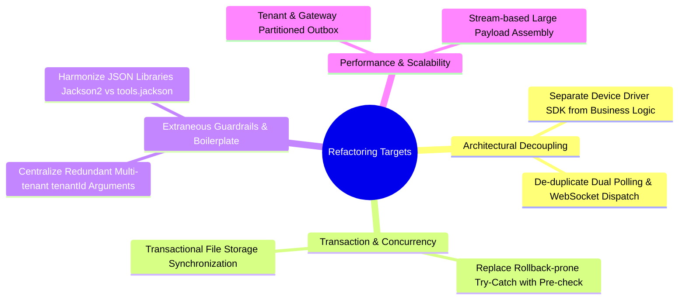

# Senior Architecture Review: Top 5 Bugs & Comprehensive Refactoring Roadmap

This document presents a deep-dive architectural and code-level audit of the **Gym Management System & TrueFace Biometric Gateway Integration** codebase, covering the Backend (Spring Boot), Windows Gateway (.NET 8), and Frontend (React/TypeScript).

---

## Part 1: Top 5 Critical Bugs & Defects

### Bug #1: WebSocket Session Race Condition & Missing Mutex on Disconnect / Close
- **Location:** [`GatewaySessionRegistry.java`](gym-app/backend/src/main/java/com/example/gym/device/GatewaySessionRegistry.java:34) and [`GatewayWebSocketHandler.java`](gym-app/backend/src/main/java/com/example/gym/device/GatewayWebSocketHandler.java:41)
- **Root Cause & Mechanism:**
  In `GatewaySessionRegistry.send()`, message transmission acquires an intrinsic lock on `session` (`synchronized(session) { session.sendMessage(...); }`). However, when `GatewayWebSocketHandler.afterConnectionClosed()` or `handleTextMessage()` is invoked concurrently from another thread or connection abort, the WebSocket session is closed, or error responses are sent directly without locking the `session` instance.
  Under Spring WebSocket with Tomcat/Undertow, calling `sendMessage` on a closing or concurrently writing session throws `IllegalStateException: The remote endpoint was in state [...] which is an invalid state for called method`.
- **System Impact:**
  During gateway network reconnect bursts or sudden disconnections, sync command dispatchers crash with uncaught runtime exceptions, interrupting the transactional outbox loop and preventing remaining queued commands from dispatching.
- **Remediation:**
  Wrap sessions in Spring's `ConcurrentWebSocketSessionDecorator` or use an explicit `ReentrantLock` per session id, checking `.isOpen()` within the guarded block.

---

### Bug #2: Outbox Dispatcher Timeout & Head-of-Line Blocking during Reclaim Cycle
- **Location:** [`DeviceSyncService.java`](gym-app/backend/src/main/java/com/example/gym/device/DeviceSyncService.java:116) and [`OutboxDispatcher.java`](gym-app/backend/src/main/java/com/example/gym/device/OutboxDispatcher.java:26)
- **Root Cause & Mechanism:**
  `DeviceSyncService.dispatchDue()` begins by invoking `reclaimStaleDispatched()` before querying pending items:
  ```java
  List<DeviceSyncCommand> stale = commandRepository.findByStateInAndDispatchedAtLessThanEqual(
      List.of(SyncCommandState.DISPATCHED, SyncCommandState.ACKNOWLEDGED), cutoff, ...);
  ```
  When one gateway is offline for an extended period, stale commands are reclaimed to `RETRYING` with `nextAttemptAt = Instant.now()`. On the very next scheduled run (default: 10s), `dispatchDue()` pulls commands ordered by `nextAttemptAt ASC`.
  Because the offline gateway's commands have older timestamps, they occupy the entire `batchSize` page (e.g. 50 items). The transport fails delivery, marks them with exponential backoff, but until all stale items back off, newly created commands for *other, fully online gateways* are starved.
- **System Impact:**
  An offline exit device at one branch will delay member enrolments and face synchronisation across all other online devices.
- **Remediation:**
  Partition the outbox dispatch by `gatewayId` or `tenantId`, or use a SQL `SKIP LOCKED` / distinct device queue approach so one offline endpoint cannot block the global dispatch pipe.

---

### Bug #3: Potential Transient Data Inconsistency / Rollback Risk in Attendance Event Ingestion
- **Location:** [`AttendanceIngestionService.java`](gym-app/backend/src/main/java/com/example/gym/device/AttendanceIngestionService.java:94)
- **Root Cause & Mechanism:**
  In `ingest()`, `attendanceRepository.save(event)` is wrapped in a `try-catch` catching `DataIntegrityViolationException` to gracefully handle duplicate composite fingerprints:
  ```java
  try {
      attendanceRepository.save(event);
  } catch (DataIntegrityViolationException dup) {
      return Optional.empty();
  }
  ```
  In Spring `@Transactional` methods backed by Hibernate/JPA, when a `DataIntegrityViolationException` or underlying database constraint exception occurs, the current physical transaction / Hibernate Session is marked for rollback (`TransactionAspectSupport` / `setRollbackOnly`).
  Catching the exception in Java code *does not clear* the transaction rollback flag. When the method finishes or calls another repository afterwards (such as `advanceWatermark`), Spring throws `UnexpectedRollbackException: Transaction silently rolled back because it has been marked as rollback-only`.
- **System Impact:**
  Duplicate attendance logs or replayed reconcile packets will trigger transaction aborts and 500 Internal Server Errors back to the Gateway instead of clean idempotency.
- **Remediation:**
  Use `attendanceRepository.saveAndFlush(event)` in an isolated nested transaction (`@Transactional(propagation = Propagation.REQUIRES_NEW)`), or perform deterministic fingerprint checks before `save()` without relying on JPA constraint violations inside the main business transaction.

---

### Bug #4: Silent Gateway WebSocket Connection Drop on JSON Payloads > 64 KB
- **Location:** [`GatewayWebSocketHandler.java`](gym-app/backend/src/main/java/com/example/gym/device/GatewayWebSocketHandler.java:43) and [`BackendLink.cs`](gym-app/gateway/src/Gym.Gateway/BackendLink.cs:80)
- **Root Cause & Mechanism:**
  In `GatewayWebSocketHandler`, `session.setTextMessageSizeLimit(MAX_TEXT_MESSAGE_BYTES)` is set on the Spring server (1 MB). However, in .NET's `ClientWebSocket` on the Gateway side, the native buffer size in `ReceiveAsync(new ArraySegment<byte>(buffer), ...)` defaults to 4 KB / 8 KB chunks.
  When the backend dispatches a large reconciliation payload or a bulk command roster update, if the C# client reads partial frames without re-assembling multipart frames into an accumulator buffer before calling `JsonSerializer.Deserialize`, the parser throws a `JsonException: '}' is an invalid end of JSON` or silently drops connection.
- **System Impact:**
  Large roster operations (e.g. gym with > 300 members receiving a device reconcile snapshot) cause the gateway to disconnect and trigger endless reconnect loops.
- **Remediation:**
  In `BackendLink.cs`, implement an explicit frame accumulator (`MemoryStream` or `ArrayBufferWriter<byte>`) that loops over `WebSocketReceiveResult.EndOfMessage == false` before attempting JSON deserialization.

---

### Bug #5: File-System Storage vs DB State Divergence in Face Photo Uploads
- **Location:** [`MemberFaceService.java`](gym-app/backend/src/main/java/com/example/gym/face/MemberFaceService.java:54) and [`FaceStorageService.java`](gym-app/backend/src/main/java/com/example/gym/face/FaceStorageService.java:50)
- **Root Cause & Mechanism:**
  When a new face photo is uploaded, `FaceStorageService.store(key, bytes)` writes the file to physical disk *prior* to or *during* the Spring JPA transaction commit:
  ```java
  @Transactional
  public MemberFace upload(String memberPublicId, byte[] rawBytes, Long tenantId) {
      ...
      String key = storage.store(bytes); // 1. Writes file to disk
      MemberFace saved = faceRepository.save(face); // 2. DB entity saved
      provisioning.pushFace(member, saved); // 3. Enqueues outbox command
      return saved;
  }
  ```
  If step 2 or step 3 fails (e.g., database constraint violation, tenant mismatch, outbox serialize failure), the transaction rolls back, but the physical file remains orphaned on disk.
  Conversely, during `delete()`, `storage.deleteQuietly(key)` deletes the file immediately. If the database transaction subsequently fails to commit, the database still references a non-existent file on disk, corrupting subsequent sync operations to devices.
- **System Impact:**
  Disk exhaustion from orphaned binary blobs and 404 image errors during device roster syncs.
- **Remediation:**
  Register file system mutations via Spring's `TransactionSynchronizationManager.registerSynchronization(new TransactionSynchronization() { void afterCommit() { ... } })` so disk writes and deletions only execute after the database transaction has committed.

---

## Part 2: Code Refactoring Opportunities & Sub-Standard Patterns



### 1. Heterogeneous JSON Parsing Libraries (`com.fasterxml.jackson` vs `tools.jackson`)
- **Observed Issue:** The backend imports the experimental `tools.jackson.databind.json.JsonMapper` across device/protocol packages while the rest of Spring Boot uses standard Jackson 2 (`com.fasterxml.jackson.databind.ObjectMapper`).
- **Why It Needs Refactoring:** Having two distinct Jackson library generations in the same classpath leads to ClassCastExceptions, redundant configurations, and prevents Spring Boot auto-configuration from tuning Jackson serializers globally.
- **Refactoring Recommendation:** Standardize on Spring Boot's managed `ObjectMapper` everywhere.

---

### 2. Boilerplate Overhead: Manual `tenantId` Passing in Service Interfaces
- **Observed Issue:** Nearly every service method signature manually expects `(..., Long tenantId)` extracted from `SecurityUtils.currentTenantId()` at the controller layer:
  ```java
  faceService.upload(id, bytes, SecurityUtils.currentTenantId());
  membershipService.getByPublicId(id, SecurityUtils.currentTenantId());
  ```
- **Why It Needs Refactoring:** This creates significant boilerplate across 20+ controllers and leaves room for accidental omission or tenant leakage if a developer queries by `publicId` without filtering by `tenantId`.
- **Refactoring Recommendation:** Introduce a `TenantContext` scoped bean or Spring Data JPA `@TenantFilter` / Hibernate Multi-tenancy filter to automatically append `WHERE tenant_id = ?` to all entity operations.

---

### 3. Redundant Polling vs. WebSocket Synchronization Pipeline
- **Observed Issue:** The system contains two concurrent dispatch pathways:
  1. `OutboxDispatcher.java` (running every 10s via `@Scheduled`)
  2. `GatewayCommandPollService.java` (servicing `GET /internal/gateway/commands` pollers)
- **Why It Needs Refactoring:** If both a WSS connection and REST fallback poller are active (e.g., during flapping connectivity), both threads attempt to claim and mark commands `DISPATCHED`. Despite optimistic locking, this creates high database contention and duplicate command delivery attempts.
- **Refactoring Recommendation:** Implement a single event-driven transport distributor that prioritizes the active WebSocket session and only allows REST polling if no live session is registered.

---

### 4. Excessive Synchronous Re-reads in Gateway (`DeviceChangeWatcher.cs`)
- **Observed Issue:** In `DeviceChangeWatcher.cs`, every 60 seconds the gateway queries the entire roster from the hardware, then executes `FaceSweepMinutes` (every 30m) by issuing individual `GetFace()` calls for every member sequentially over NetSDK.
- **Why It Needs Refactoring:** TrueFace hardware has limited CPU and embedded flash memory. Scanning 300+ faces synchronously over Dahua TCP 37777 every 30 minutes degrades device access verification performance for gym members standing at the door.
- **Refactoring Recommendation:** Rely on SDK alarm callbacks (`fMessCallBack` / `ALARM_ACCESS_CTL_EVENT`) for instant local changes, and only do incremental delta checks using the device's record watermark (`recNo`).

---

### 5. Monolithic `DeviceUserChangeService.java` (580+ lines)
- **Observed Issue:** [`DeviceUserChangeService.java`](gym-app/backend/src/main/java/com/example/gym/device/DeviceUserChangeService.java) handles user creation, name parsing, status toggling, date overlap checks, conflict generation, face uploads, and device code clashes in a single giant class.
- **Why It Needs Refactoring:** Violates the Single Responsibility Principle (SRP); difficult to unit-test individual conflict resolution algorithms without mocking 10+ repository dependencies.
- **Refactoring Recommendation:** Extract specific domain handlers:
  - `DeviceRosterConflictResolver` (for code clashes & overlap policies)
  - `DeviceMemberReconciliationHandler` (for member sync state machine)
  - `DeviceFaceSyncHandler` (for biometric versioning & storage)

---

## Part 3: Architecture Refactoring Summary Matrix

| Domain | Area | Issue Description | Proposed Architecture Pattern | Priority |
| :--- | :--- | :--- | :--- | :--- |
| **Concurrency** | `GatewaySessionRegistry` | Potential `IllegalStateException` on concurrent WSS send/close. | Decorate with Thread-safe WebSocket Wrapper / Lock. | **P0 (Critical)** |
| **Transaction** | `AttendanceIngestionService` | Caught JPA `DataIntegrityViolation` marks transaction rollback-only. | Separate validation transaction or check-before-insert. | **P0 (Critical)** |
| **Performance** | `DeviceSyncService` | Stale command reclaim blocks entire queue for other devices. | Partitioned / Tenant-scoped Outbox Dispatch. | **P1 (High)** |
| **Reliability** | `MemberFaceService` | Local disk files written/deleted outside DB transaction commit. | `TransactionSynchronizationManager.afterCommit()`. | **P1 (High)** |
| **Maintainability**| Multi-tenancy | Manual `tenantId` parameter drilling across all layers. | Hibernate Multi-Tenant Filter or Context Interceptor. | **P2 (Medium)** |
| **Code Quality** | Gateway / Backend | Dual JSON libraries (`tools.jackson` vs standard Jackson). | Consolidate on Spring-managed `ObjectMapper`. | **P2 (Medium)** |
