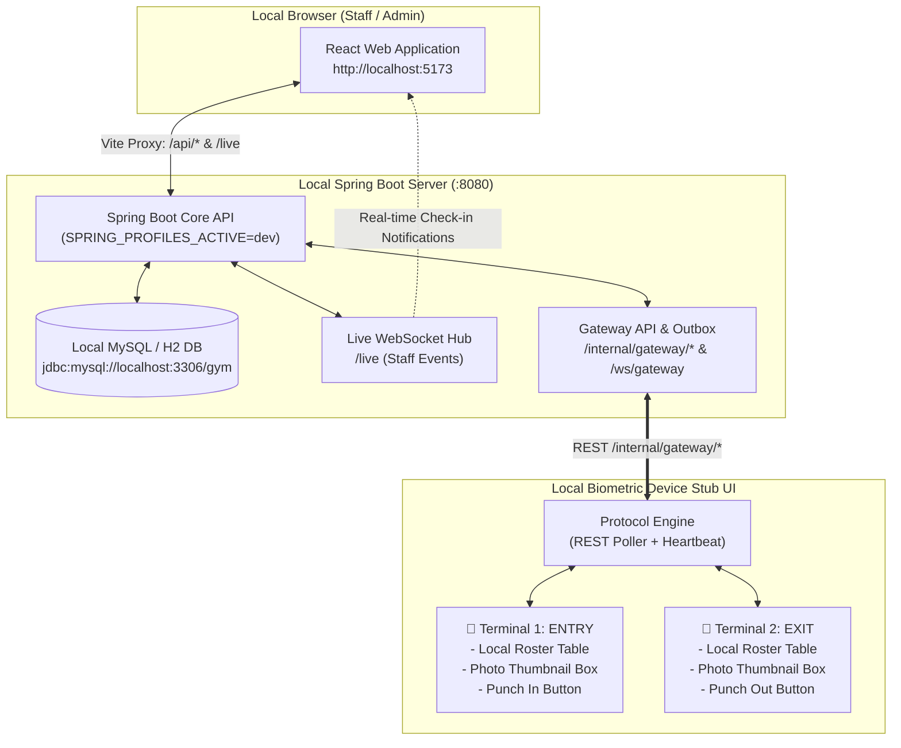

# Interactive Biometric Device Stub — Complete Local Testing & Operations Guide

This guide is the complete, self-contained runbook for running and testing the entire Gym Application stack (**React Frontend**, **Spring Boot Backend**, and **Interactive Biometric Device Stub**) completely on your **local machine** (no cloud deployment and no physical hardware needed).

It details:
1. **Local Architecture & Communication Flow**
2. **Pre-requisites & Local Environment Setup**
3. **Exact Configurations Needed for Local Testing (What to change & why)**
4. **Step-by-Step Execution Runbook**
5. **Live Feature Testing Procedures (Member creation, photo upload, punches, offline sync)**
6. **Step-by-Step Rollback Guide for Production / Deployment (What to revert before going live)**

---

## 1. Local Architecture & Component Layout

When running locally, all three components live on `localhost` (127.0.0.1) and communicate seamlessly:



---

## 2. Prerequisites & Environment Setup

Ensure you have the following installed locally:
- **Java 21+** (JDK)
- **Node.js 18+** & npm
- **Python 3.9+** (with Tkinter enabled)
- **MySQL 8.0+** (or Docker running MySQL)

### Python Simulator Dependencies
In a terminal, navigate to `simulator/` and install required packages:
```bash
cd gym-app/simulator
pip install -r requirements.txt
```
*(Requires `pillow>=10.0.0`, `requests>=2.31.0`)*

---

## 3. Configuration Matrix: What to Change for Local Testing

To test everything locally, you only configure environment variables or local properties. **Do not modify production code.**

### 3.1 Backend Configuration (`application-dev.yml`)
Spring Boot already has an `application-dev.yml` file configured for local development.

| Parameter / Env Variable | Value for Local Testing | Purpose |
| :--- | :--- | :--- |
| `SPRING_PROFILES_ACTIVE` | `dev` | Activates dev profile, runs dev data seeder (`superadmin`), and enables CORS for Vite. |
| `DB_URL` | `jdbc:mysql://localhost:3306/gym?useSSL=false&allowPublicKeyRetrieval=true&serverTimezone=UTC` | Local MySQL connection string. |
| `DB_USERNAME` / `DB_PASSWORD` | `gym` / `gym` (or your local MySQL credentials) | Database credentials. |
| `APP_FACES_DIR` | `./data/faces` | Stores member face photos in a local folder rather than `/var/lib/gym/faces`. |
| `APP_GATEWAY_OUTBOX_DISPATCHER_ENABLED` | `true` | Enables outbox command dispatcher to queue commands for the stub. |

### 3.2 Frontend Configuration (`vite.config.ts`)
The React frontend via Vite is pre-configured with local proxy rules:
- `/api` $\rightarrow$ `http://127.0.0.1:8080`
- `/live` $\rightarrow$ `http://127.0.0.1:8080` (WebSocket)
- No changes required in `vite.config.ts`. Leave `VITE_API_BASE` blank in `frontend/.env`.

### 3.3 Simulator Configuration (`interactive_device_stub.py`)
The Python Stub UI reads either environment variables or inputs typed into the top bar:

| Field in Stub UI | Value for Local Testing |
| :--- | :--- |
| **Backend URL** | `http://127.0.0.1:8080` |
| **Gateway ID** | `<Gateway Public ID generated from Web UI>` (e.g., `gw_01j...`) |
| **Gateway Token** | `<One-time Enrollment Token or Operational Credential>` |

---

## 4. Step-by-Step Execution Runbook

Follow these steps in order to start the entire local ecosystem:

### Step 1: Start the Local Database
Ensure MySQL is running and create the database user and schema:
```sql
CREATE DATABASE IF NOT EXISTS gym CHARACTER SET utf8mb4 COLLATE utf8mb4_unicode_ci;
CREATE USER IF NOT EXISTS 'gym'@'%' IDENTIFIED BY 'gym';
GRANT ALL PRIVILEGES ON gym.* TO 'gym'@'%';
FLUSH PRIVILEGES;
```

### Step 2: Start the Spring Boot Backend
In terminal 1:
```powershell
cd "gym-app\backend"
$env:SPRING_PROFILES_ACTIVE="dev"
$env:DB_URL="jdbc:mysql://localhost:3306/gym?useSSL=false&allowPublicKeyRetrieval=true&serverTimezone=UTC"
$env:DB_USERNAME="gym"
$env:DB_PASSWORD="gym"
.\mvnw.cmd spring-boot:run
```
*Wait until you see:* `Started GymBackendApplication in X.XXX seconds`.

### Step 3: Start the React Frontend
In terminal 2:
```powershell
cd "gym-app\frontend"
npm install
npm run dev
```
*Vite will start at `http://localhost:5173`.*

### Step 4: Bootstrap the Gym, Gateway & Devices in Web UI
1. Open your browser at `http://localhost:5173`.
2. Login as Super Admin:
   - **Username:** `superadmin`
   - **Password:** `ChangeMe123!`
3. Go to **Platform / Gyms** $\rightarrow$ Click **Create Gym**:
   - Gym Name: `Power Gym Local`
   - Admin Email: `admin@powergym.local`
   - Set password and login as Gym Admin.
4. In the Gym Admin Dashboard, navigate to **Settings / Gateways** $\rightarrow$ Click **Create Gateway**:
   - Name: `Local Test Gateway`
   - **Copy the generated Gateway ID and Token!** (You will paste these into the Python Stub).
5. Navigate to **Devices** $\rightarrow$ Click **Add Device**:
   - Device 1: Name = `Main Entrance Gate`, Role = `ENTRY`, assign to `Local Test Gateway`. Note the **Device ID**.
   - Device 2: Name = `Main Exit Gate`, Role = `EXIT`, assign to `Local Test Gateway`. Note the **Device ID**.

### Step 5: Launch the Python Biometric Device Stub UI
In terminal 3:
```powershell
cd "gym-app\simulator"
python interactive_device_stub.py
```
In the Stub Window:
1. Ensure Backend URL is `http://127.0.0.1:8080`.
2. Enter the **Gateway ID** and **Token** obtained from Step 4.
3. Click **Connect / Start Sync**.
4. The status badge will switch to `🟢 Status: CONNECTED & POLLING`.

---

## 5. Live Feature Testing Scenarios

With the full local stack running, execute these 5 key test flows:

### Test Case 1: Member Enrolment & Photo Sync (Cloud $\rightarrow$ Device)
1. In the Web UI, go to **Members** $\rightarrow$ Click **New Member**.
2. Fill Name: `John Doe`, Code: `1001`, Email: `john@example.com`.
3. Under **Member Photo**, upload any JPEG face image from your computer.
4. Click **Save & Assign Membership**.
5. **Verify on Device Stub:**
   - Within 2–10 seconds, `John Doe` will appear in both the **Entry** and **Exit** roster tables in the Stub.
   - Click on `John Doe` in the Stub table $\rightarrow$ The user's face photo will be decoded and rendered in the photo box!
   - In the Web UI, the member's device sync badge updates to `🟢 Photo on device / Synced`.

---

### Test Case 2: Live Attendance Ingestion & Live Check-in Popup
1. In the Web UI, keep the **Live Attendance Dashboard** open.
2. In the Python Device Stub:
   - Click the **📍 Terminal 1: ENTRY** tab.
   - Select `John Doe (1001)`.
   - Click **🟢 Punch ENTRY (Grant Access)**.
3. **Verify:**
   - The Stub logs: `⚡ Punched ENTRY for John Doe (1001) -> Granted: True`.
   - The React Web UI immediately triggers a sound / live check-in card showing `John Doe - Entry Granted` along with his photo in real time!
   - Navigate to **Reports / Attendance** $\rightarrow$ An attendance record is logged with direction = `ENTRY`.

---

### Test Case 3: Simulating Exit & Workout Duration Calculation
1. In the Python Device Stub:
   - Click the **🚪 Terminal 2: EXIT** tab.
   - Select `John Doe (1001)`.
   - Click **🟢 Punch EXIT (Grant Access)**.
2. **Verify:**
   - The Web UI registers the exit punch and closes the workout session, displaying the total workout duration.

---

### Test Case 4: Membership Freeze / Access Denied Enforcement
1. In the Web UI, open `John Doe` $\rightarrow$ Click **Memberships** $\rightarrow$ **Freeze Membership**.
2. **Verify on Device Stub:**
   - The backend outbox issues `DISABLE_USER`.
   - In the Stub roster, `John Doe`'s status automatically turns to `🔴 Disabled`.
3. Try to Punch:
   - Click **🟢 Punch ENTRY**.
   - The Stub sends `granted=False`.
   - Web UI live screen shows `Access Denied: Membership Frozen`.

---

### Test Case 5: Direct Device Enrollment (Device $\rightarrow$ Cloud Sync)
*Simulate enrolling a walk-in member directly on the physical terminal screen.*
1. In the Device Stub, click **➕ Local Terminal Enrollment**.
2. Enter User ID: `2002`, Name: `Sarah Smith`, choose a local photo image.
3. Click **Save & Sync to Cloud**.
4. **Verify:**
   - The Stub sends `DEVICE_USER_CHANGED` upstream.
   - Refresh the Web UI **Members** page $\rightarrow$ A new member `Sarah Smith` is automatically created with `Source: Device` and her photo is stored!

---

## 6. Step-by-Step Reversion Guide (Preparing for Production)

When you finish local testing and prepare to build the `.msi` Gateway or deploy to the live VPS / cloud:

### Checklist of Settings to Revert:

| Item | Local Testing State | Production State | Action to Revert |
| :--- | :--- | :--- | :--- |
| **Backend Profile** | `SPRING_PROFILES_ACTIVE=dev` | `SPRING_PROFILES_ACTIVE=prod` | Switch profile in production `docker-compose.yml` or environment variables. |
| **Face Storage Path** | `./data/faces` | `/var/lib/gym/faces` (Persistent Docker Volume) | Unset `APP_FACES_DIR` so it defaults to the production volume. |
| **JWT Secret** | `dev-only-insecure-secret...` | High-entropy 256-bit random secret | Set `APP_SECURITY_JWT_SECRET` in production `.env`. |
| **Frontend API Base** | Proxied via Vite (`localhost:5173`) | Same-origin relative paths (`/api`) behind Cloudflare/Nginx | Ensure `VITE_API_BASE` remains blank in production build. |
| **Gateway Adapter** | Simulated Stub (`interactive_device_stub.py`) | Real Windows Gateway `.msi` (`Adapter: TrueFace`) | In `appsettings.json` on the gym Windows PC, ensure `"Adapter": "TrueFace"` and install `dhnetsdk.dll`. |
| **Outbox Dispatcher** | Local poller / WSS | Production WSS (`wss://gym.yourdomain.com/gateway`) | Ensure production gateway points to the secure HTTPS/WSS domain. |

---

## 7. Troubleshooting Common Local Issues

1. **Stub shows `Connection Refused (599)`**:
   - Ensure the backend is running on `http://127.0.0.1:8080`.
   - Check if you entered the correct `GYM_BACKEND` URL.
2. **Stub shows `HTTP 401 Unauthorized`**:
   - Your Gateway Token or Gateway ID is incorrect. Reissue a token from **Settings / Gateways** in the Web UI.
3. **Photos not rendering in Stub**:
   - Ensure `pillow` is installed (`pip install pillow`).
   - Confirm the uploaded photo is a valid JPEG/PNG.
4. **Commands not reaching the Stub**:
   - Check `app.gateway.outbox.dispatcher-enabled=true` in backend config.
   - Check the `📜 Protocol & Traffic Logs` tab in the Stub window for incoming message traces.
