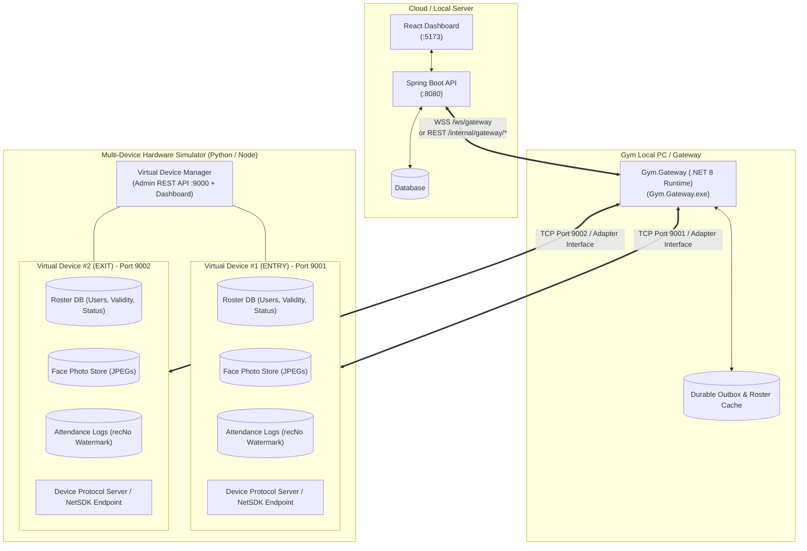

# Comprehensive Analysis & Architecture: TrueFace Device Emulator / Node Server Simulator

**Document Reference:** `gym-app/docs/doc for node servers.pdf`  
**Purpose:** Provide a rigorous architectural analysis and hardware-level contract of the TrueFace 3000 (Dahua NetSDK) devices and specify the next-generation Device Simulator Architecture (Virtual Device Servers) to test the **actual .NET Gateway** and **Spring Boot Backend** end-to-end.

---

## 1. Architectural Distinction: Protocol Mock vs. Hardware-Facing Simulator

### The Core Problem in v1:
Previously, the simulator (`gateway_simulator.py` and `interactive_device_stub.py`) acted as a **Gateway substitute** talking directly to the Spring Boot REST/WSS endpoint (`/internal/gateway/messages`). 

This left the **actual .NET Gateway (`Gym.Gateway.exe`) untested**, along with its:
- Local offline caching (`LocalMemberStore`, `RosterStateStore`)
- Automatic retry outbox (`DurableOutboundStore`)
- Background polling loops (`DeviceChangeWatcher`, 60s roster sweep, 30m face sweep)
- Native adapter lifecycle and error handling (`IDeviceAdapter` $\rightarrow$ `TrueFaceDeviceAdapter` / `MockDeviceAdapter`)

### The Target Architecture:
We simulate the **physical devices on the local LAN** so that the real .NET Gateway runs unmodified in the middle:



---

## 2. Hardware Contract: Complete Device API & NetSDK Method Catalog

Derived directly from `gateway/src/Gym.Gateway.Adapters/`, `TrueFace_SDK/`, and `docs/device-sdk.md`:

### 2.1 Device Identification & Session Lifecycle
| Device Operation | Gateway Adapter Call (`IDeviceAdapter`) | Native NetSDK C# Wrapper (`NetSDKCS`) | Parameters & Payload | Verification Status |
| :--- | :--- | :--- | :--- | :--- |
| **Login / Connect** | `Connect(config)` | `NETClient.LoginWithHighLevelSecurity` | `(ip, port, username, password, TCP, Zero, ref NET_DEVICEINFO_Ex)` | `VERIFIED` |
| **Disconnect / Logout** | `Disconnect()` | `NETClient.Logout(loginId)` | `(loginId)` | `VERIFIED` |
| **Start Event Listener** | `Connect()` | `NETClient.StartListen(loginId)` & `NETClient.SetDVRMessCallBack(cb)` | Captures live door alarms & access events (`ALARM_ACCESS_CTL_EVENT`) | `VERIFIED` |
| **Get Device Info** | `GetDeviceInfo()` | Read from cached `NET_DEVICEINFO_Ex` | Serial number, DVR type, channel count, alarm in/out counts | `VERIFIED` |
| **Time Sync** | `SynchronizeTime(utcNow)` | `NETClient.SetupDeviceTime` | `NET_TIME` struct (Year, Month, Day, Hour, Min, Sec) | `DOC` |

### 2.2 User Roster & Card Management
| Device Operation | Gateway Adapter Call | Native NetSDK Call | Request / Response Structure | Error / Return Semantics |
| :--- | :--- | :--- | :--- | :--- |
| **Create / Update User** | `CreateUser(mutation)`, `UpdateUser(mutation)` | `NETClient.OperateAccessUserService` | **In:** `EM_NET_RECORD_SET_TYPE.INSERT` / `UPDATE`, `NET_ACCESS_USER_INFO` (UserID, UserName, UserType, Pwd, DoorType, TimeSlots). | Returns `bool`. On fail: `NETClient.GetLastError()`. |
| **Disable / Enable User** | `DisableUser(id)`, `EnableUser(id)` | `NETClient.OperateAccessUserService` | Sets `szStartTime` and `szEndTime` or `byUserType` to active/inactive. | Returns `bool`. |
| **Delete User** | `DeleteUser(id)` | `NETClient.RemoveOperateAccessUserService` | **In:** Array of user ID strings `[ "1001" ]`. | Returns `bool` + array of fail codes. |
| **Enumerate Users (Paged)** | `ListUsers()` | `NETClient.StartFindUserInfo` & `NETClient.DoFindUserInfo` | **In:** Find handle query.<br>**Out:** Paged list of `NET_ACCESS_USER_INFO` (`szUserID`, `szName`, `szStartTime`, `szEndTime`). | Returns count and user array until handle exhausted. |
| **Get Single User** | `GetUser(id)` | `NETClient.GetOperateAccessUserService` | **In:** `szUserID`.<br>**Out:** `NET_ACCESS_USER_INFO`. | Returns `null` if not found. |

### 2.3 Biometrics (Face Photo Management)
| Device Operation | Gateway Adapter Call | Native NetSDK Call | Request / Response Structure | Error / Return Semantics |
| :--- | :--- | :--- | :--- | :--- |
| **Insert Face** | `UpsertFace(id, bytes)` | `NETClient.OperateAccessFaceService(INSERT)` | **In:** `NET_IN_ACCESS_FACE_SERVICE_INSERT` (UserID, `byte[]` JPEG buffer $\le 120\text{ KB}$). | Returns `bool`. On fail returns SDK hex code (e.g., `0x10030110` firmware reject or `0x00000000` success). |
| **Update Face** | `UpsertFace(id, bytes)` | `NETClient.OperateAccessFaceService(UPDATE)` | **In:** `NET_IN_ACCESS_FACE_SERVICE_UPDATE`. | Tried first before INSERT. |
| **Read Face** | `GetFace(id)` | `NETClient.GetAccessFaceInfo` | **In:** `szUserID`.<br>**Out:** Photo `byte[]` buffer + modification timestamp. | Returns photo bytes or None. |
| **Delete Face** | `DeleteFace(id)` | `NETClient.OperateAccessFaceService(DELETE)` | **In:** `szUserID`. | Removes biometric template and photo from device flash. |

### 2.4 Attendance & Door Operations
| Device Operation | Gateway Adapter Call | Native NetSDK Call | Request / Response Structure | Error / Return Semantics |
| :--- | :--- | :--- | :--- | :--- |
| **Open Door** | `OpenDoor()` | `NETClient.ControlDevice(ACCESS_OPEN)` | **In:** Channel 0, door index 0. | Fires relay unlock. |
| **Close Door** | `CloseDoor()` | `NETClient.ControlDevice(ACCESS_CLOSE)` | **In:** Channel 0, door index 0. | Fires relay lock. |
| **Live Access Callback** | `fMessCallBack` | Registered delegate | **Out:** `NET_ACCESS_CTL_EVENT_INFO` (`szUserID`, `nRecNo`, `bAllowed`, `emOpenMethod`=FACE/CARD, `stuTime`). | Gateway normalizes to `NormalizedDeviceEvent("ACCESS", ...)`. |
| **Query Historical Logs** | `FetchAttendance(from, to)` | `NETClient.FindRecord` (`ACCESSCTLCARDREC_EX`) | **In:** Start time, End time.<br>**Out:** Array of `NET_RECORD_ACCESSCTLCARDREC_EX` (recNo, userId, time, allowed). | Paged batch retrieval. |

---

## 3. Detailed Data & Event Flows in the System

### 3.1 Downstream Member Enrolment & Face Sync Flow
```
1. Admin (React UI) -> POST /api/v1/members + POST /api/v1/members/{id}/face
2. Spring Boot -> Inserts Member & MemberFace into DB -> Enqueues CREATE_USER & UPSERT_FACE in DeviceSyncCommand (Outbox)
3. OutboxDispatcher -> Pushes commands over WSS /ws/gateway to .NET Gateway
4. .NET Gateway CommandDispatcher -> Calls IDeviceAdapter.CreateUser() and UpsertFace()
5. IDeviceAdapter -> Sends NetSDK packets / TCP commands to Device Simulator (:9001 and :9002)
6. Device Simulator -> Stores User in Roster DB and Face Photo in Local Memory/Disk -> Returns Success
7. .NET Gateway -> Replies with SYNC_RESULT {ok: true} to Spring Boot
8. Spring Boot -> Marks DeviceSyncCommand COMPLETED and MemberDeviceMapping SYNCED
```

### 3.2 Upstream Attendance Event Flow (Badge / Face Scan)
```
1. Tester triggers punch on Virtual Device #1 (ENTRY) via Simulator Admin API / UI
2. Virtual Device #1 -> Generates Attendance Record (recNo=501, userId=1001, method=FACE, granted=True)
3. Virtual Device #1 -> Fires event notification to .NET Gateway
4. .NET Gateway ForwardingListener -> Normalizes to DEVICE_EVENT envelope -> Queues in DurableOutboundStore
5. .NET Gateway BackendLink -> Pushes DEVICE_EVENT to Spring Boot (/ws/gateway or /internal/gateway/messages)
6. Spring Boot AttendanceIngestionService -> Saves AttendanceEvent -> Updates Watermark Cursor -> Publishes StaffLiveBroadcast
7. Spring Boot WebSocket (/live) -> Pushes event to React UI
8. React Staff Dashboard -> Live check-in card appears with member photo and audio chime
```

### 3.3 Upstream Local Terminal Modification Flow (Two-Way Sync)
```
1. Operator adds or edits a user directly on the Virtual Terminal (:9001)
2. .NET Gateway DeviceChangeWatcher -> Detects new user / changed validity during 60s roster poll or alarm event
3. .NET Gateway -> Updates LocalMemberStore on disk -> Propagates change immediately to Virtual Device #2 (EXIT)
4. .NET Gateway -> Enqueues DEVICE_USER_CHANGED envelope to Spring Boot
5. Spring Boot DeviceUserChangeService -> Reconciles change (Latest Change Wins) -> Auto-creates/updates Member
```

---

## 4. Multi-Device Hardware Simulator Specification

### 4.1 Server Architecture
A single process (Python / Node.js) hosting $N$ independent virtual devices:

```
sim-server/
├── server.py (or server.js)         # Multi-device host process & HTTP Admin REST API (:9000)
├── virtual_device.py               # Stateful device engine (Roster, Photos, Logs, Fault Injectors)
├── device_protocol_endpoint.py     # Network listener (TCP / HTTP endpoint per device)
├── static/                         # Web-based Admin Testing Console (Dashboard)
│   ├── index.html
│   └── app.js
└── data/                           # In-memory or SQLite persisted device flash stores
```

### 4.2 Configuration Model
```json
{
  "adminPort": 9000,
  "devices": [
    {
      "id": "dev-entry-01",
      "name": "Main Entrance Terminal",
      "role": "ENTRY",
      "port": 9001,
      "serialNumber": "TW30000005250265",
      "firmware": "V1.000.004H003.0.R.20250424",
      "maxFaces": 5000,
      "simulateFirmwareReject": false
    },
    {
      "id": "dev-exit-02",
      "name": "Main Exit Terminal",
      "role": "EXIT",
      "port": 9002,
      "serialNumber": "TW30000005250266",
      "firmware": "V1.000.004H003.0.R.20250424",
      "maxFaces": 5000,
      "simulateFirmwareReject": false
    }
  ]
}
```

---

## 5. Simulator Admin API & Chaos Engineering Capabilities

The Multi-Device Simulator exposes an Admin REST API on port `9000` to orchestrate automated test suites and manual chaos testing:

### 5.1 Device Management & Inspection
- `GET /api/devices`: List all running virtual devices, their connection status, and port bindings.
- `GET /api/devices/{id}/roster`: Retrieve all users, validity dates, enabled statuses, and face hashes currently held on the device.
- `GET /api/devices/{id}/photos/{userId}`: Download the exact JPEG face photo stored in the virtual device flash.
- `GET /api/devices/{id}/attendance`: Fetch historical access log records with `recNo` watermarks.

### 5.2 Direct Device Modification (Simulating Walk-ins & Terminal Edits)
- `POST /api/devices/{id}/users`: Create a user directly on the device.
  ```json
  {
    "userId": "3003",
    "name": "Walk-in Member",
    "enabled": true,
    "validFrom": "2026-01-01T00:00:00Z",
    "validTo": "2026-12-31T23:59:59Z",
    "photoBase64": "..."
  }
  ```
- `PUT /api/devices/{id}/users/{userId}`: Modify validity dates or freeze user locally on device.
- `DELETE /api/devices/{id}/users/{userId}`: Delete user from terminal.

### 5.3 Simulating Biometric Punches
- `POST /api/devices/{id}/punch`:
  ```json
  {
    "userId": "1001",
    "method": "FACE",
    "overrideGranted": null,
    "timestamp": "2026-04-16T10:30:00Z"
  }
  ```

### 5.4 Chaos Engineering & Fault Injection Endpoints
- `POST /api/devices/{id}/faults/offline`: Cut network interface to simulate severed LAN cable or power outage.
- `POST /api/devices/{id}/faults/latency`: Inject artificial latency (e.g. `latencyMs: 6000` to test gateway timeouts).
- `POST /api/devices/{id}/faults/error-rate`: Force device to return SDK error codes (e.g., `0x10030110` on face insert or `0xFFFFFFFF` system busy).
- `POST /api/devices/{id}/faults/corrupt-response`: Return malformed packets to test gateway resilience.
- `POST /api/devices/{id}/reset`: Clear roster or simulate factory reset.

---

## 6. Comprehensive Test Scenario Matrix

| Scenario # | Test Case Description | Injected Condition | Expected Behavior Across Entire Stack |
| :--- | :--- | :--- | :--- |
| **SC-01** | **Normal 2-Door Sync** | Admin creates member + photo in React UI. | Gateway receives command $\rightarrow$ writes to Device 1 (:9001) and Device 2 (:9002) $\rightarrow$ both return success $\rightarrow$ React UI shows "Photo on device". |
| **SC-02** | **One Device Offline During Sync** | Device 2 (:9002) set to `offline`. Member created. | Gateway successfully updates Device 1 $\rightarrow$ queues Device 2 in `DurableOutboundStore`. When Device 2 restored $\rightarrow$ Gateway drains queue and syncs Device 2. |
| **SC-03** | **Terminal Walk-in Enrollment** | Operator enrolls user 4004 on Device 1. | Gateway detects change $\rightarrow$ writes to Device 2 within 60s $\rightarrow$ uploads to Backend $\rightarrow$ Backend auto-creates Member in React UI. |
| **SC-04** | **Stale Conflict (Latest Change Wins)** | Gateway offline. Member renamed in React to "John A"; renamed on Device 1 to "John B" 5 mins later. Gateway reconnected. | "John B" wins (later timestamp). Device 2 and Backend update to "John B". Member audit log records "Sync change ignored" for John A. |
| **SC-05** | **Expired Membership Lockout** | Member validity ends at 23:59:59. | Virtual Device refuses punch locally with `bAllowed=false`. Live Staff UI displays red "Access Denied: Expired". |
| **SC-06** | **Burst Attendance Flood** | 100 punches triggered in 5 seconds across both doors. | Gateway queues events without loss $\rightarrow$ Backend ingests with deduplicated `recNo` $\rightarrow$ No 500 errors or dropped events. |

---

## 7. Migration Plan from v1 to Next-Gen Simulator

1. **Retain GUI Assets**: The Tkinter/Web GUI layout and visual photo rendering logic from `interactive_device_stub.py` will serve as the frontend console for the Multi-Device Simulator.
2. **Gateway Configuration**: Point `Gym.Gateway/appsettings.json` devices to the simulated endpoints (`127.0.0.1:9001` and `127.0.0.1:9002`).
3. **Execution Pipeline**:
   - Terminal 1: Backend (`mvnw spring-boot:run`)
   - Terminal 2: Frontend (`npm run dev`)
   - Terminal 3: Multi-Device Simulator Server (`python sim_server.py`)
   - Terminal 4: Actual .NET Gateway (`dotnet run --project src/Gym.Gateway`)
