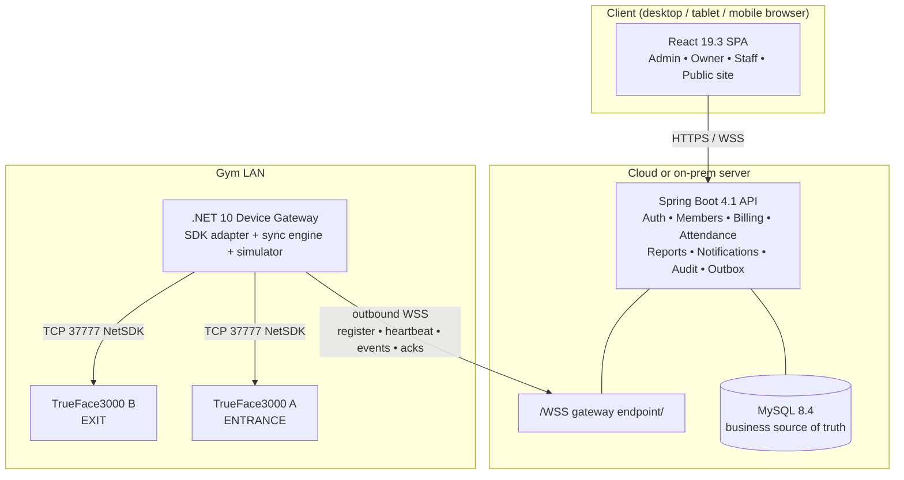
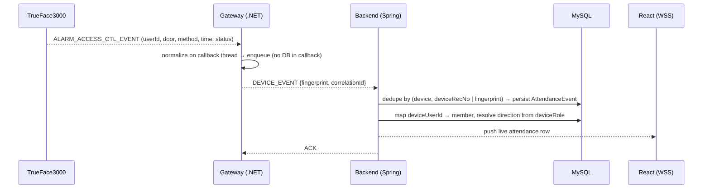
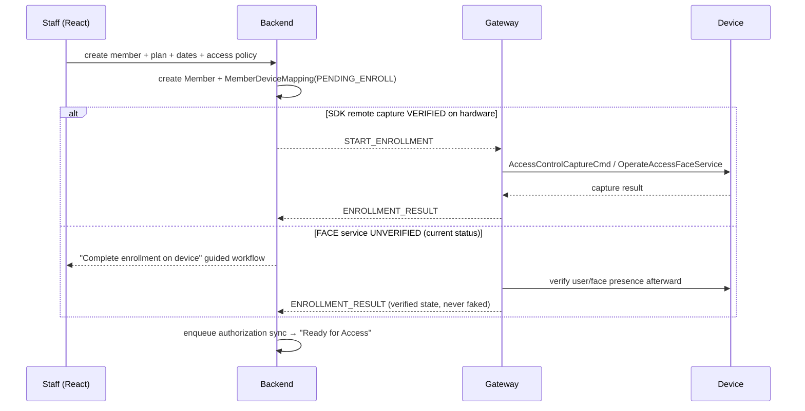
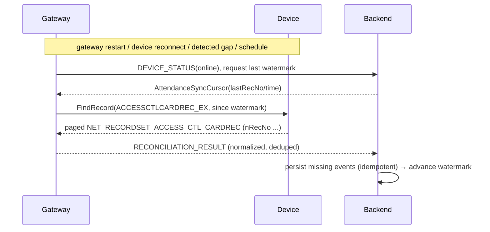

# Phase 0 — Repository, SDK & Architecture Assessment

**Project:** Smart Gym Management Platform + TrueFace3000 Integration
**Date:** 2026-09-10
**Status:** Phase 0 complete. No application code written yet (by design).
**Scope of this document:** repository inspection, TrueFace SDK capability assessment,
dependency/version verification, and the architecture/decision baseline that Phases 1–8 build on.

> This is the *First Deliverable* required by the master prompt (§61). It intentionally does
> **not** implement the application. It establishes verified facts, decisions, and boundaries so
> later phases never guess about SDK behaviour or dependency compatibility.

---

## 1. Repository Inspection — What Actually Exists Today

The repository is a **greenfield workspace** (no git history, no build files) containing planning
material and a real, previously-used vendor SDK.

| Path | Type | Relevance |
| --- | --- | --- |
| `Smart_Gym_Copilot_Master_Prompt.md` | Spec | The authoritative requirements document. |
| `conversation-summary.md` | Investigation log | Prior SDK/hardware feasibility Q&A (6 evidence layers). |
| `TrueFace3000-Datasheet-Ver.2.0.pdf` | Hardware datasheet | Capacities, verification methods, networking, alarms. |
| `Hardware Data Access Feasibility.pdf` | Report | Feasibility analysis (cloud/local, SDK access). |
| `HR13_Smart_Gym_Software_Proposal.pdf` | Proposal | Commercial/product framing. |
| `TrueFace_SDK/` | **Vendor SDK (real)** | Dahua **NetSDK** C#/.NET binding + working WinForms demo. |

### 1.1 The `TrueFace_SDK/` folder (the critical asset)

```
TrueFace_SDK/
  NetSDK Programming Manual (Intelligent Building).pdf   ← official SDK manual
  NetSDKCS/                                              ← C# managed wrapper (the binding)
    OriginalSDK.cs      (1,373 lines)  ← raw P/Invoke declarations → dhnetsdk.dll / libdhnetsdk.so
    NetSDK.cs           (9,123 lines)  ← high-level "NETClient" wrapper (managed API)
    NetSDKStruct.cs   (137,073 lines)  ← all native structs / enums / callback delegates
    bin/x64/{Debug,Release}/NetSDKCS.dll
  AccessDemo2s/                                          ← working reference application
    AccessForm.cs        ← login, event listening, door control, device caps
    UserManager/         ← user / card / fingerprint CRUD forms
    QueryRecord/         ← attendance & alarm record queries, device log query
    Setting/, Config/    ← device time, network, holidays, schedules, upgrade, reboot
```

Runtime leftovers (`bin/`, `obj/`, `sdk_log/`, camera `Capture/*.jpg`) are **not** kept in git. Face frames must not stay in the tree. Windows DLLs used by the gateway live in `gateway/native/win-x64/`.

**Conclusion:** The "TrueFace SDK" is a rebranded **Dahua NetSDK** (family `AccessControl2S`,
2nd-gen standalone access terminal). A complete, compilable C# binding and a demo that has
demonstrably talked to the physical device already exist in the repo.

### 1.2 Local toolchain observed (prerequisite gaps to close before Phase 1+)

| Tool | Installed now | Required | Action |
| --- | --- | --- | --- |
| Java (JDK) | 17.0.20 | **21 (LTS)** | Install JDK 21 before Phase 1. |
| Maven | 3.8.7 | 3.6.3+ (OK) | Fine; 3.9.x recommended. |
| Node.js | 20.19.4 | 20.19+ (min for Vite 8) | Works; **Node 22 LTS recommended**. |
| .NET SDK | not installed | **10 (LTS)** | Install for Phase 3/4 gateway. |
| MySQL | n/a | 8.4 LTS | Provisioned via Docker in Phase 1. |

---

## 2. TrueFace / Dahua NetSDK — Verified Capability Assessment

Every SDK-dependent feature below is tagged with a **verification status** (master prompt §54):

- `VERIFIED` — proven to work against the actual device in `1_sdk_log.log` or by captured artifacts.
- `DOC` — declared by the SDK manual / present as a binding, not yet exercised on this device.
- `FAILED_IN_LOG` — was attempted in the recorded session and returned an SDK error.
- `MOCK` — will be provided by the simulator until hardware confirms.

See `docs/DEVICE-SDK-NOTES.md` for the full function-level matrix. Highlights:

| Capability | Native entry point(s) | Status | Notes |
| --- | --- | --- | --- |
| SDK init / cleanup | `CLIENT_InitEx`, `CLIENT_Cleanup` | VERIFIED | Loads `avnetsdk`, `configsdk` dynamically. |
| High-security login | `CLIENT_LoginWithHighLevelSecurity` | VERIFIED | `error:0` @ 192.168.1.108:37777. |
| Auto-reconnect / disconnect cb | `CLIENT_SetAutoReconnect`, `fDisConnectCallBack` | VERIFIED | Wired in demo, called in log. |
| Device capabilities | `CLIENT_GetDevCaps(ACCESSCONTROL_CAPS)` | VERIFIED | `ret:1`; returns channel/user/card/face caps. |
| User enumeration (paged) | `CLIENT_StartFindUserInfo` / `DoFindUserInfo` | VERIFIED | `ret:1`, iterated pages. |
| User add / modify / query | `CLIENT_OperateAccessUserService` | VERIFIED* | Prior log evidence `ret:1` (add/modify/query). |
| Card enumeration | `CLIENT_StartFindCardInfo` / `DoFindCardInfo` | VERIFIED | Round-trip completed (0 cards). |
| Real-time access events | `CLIENT_SetDVRMessCallBack` + `CLIENT_StartListen` | VERIFIED | Demo receives `ALARM_ACCESS_CTL_EVENT`. |
| Attendance record query | `CLIENT_FindRecord(ACCESSCTLCARDREC_EX)` → `QueryRecordCount` → `FindNextRecord` | DOC/VERIFIED | Demo implements full paging; `nRecNo` = stable per-device id. |
| Door open/close | `CLIENT_ControlDevice(ACCESS_OPEN/ACCESS_CLOSE)` | DOC | Demo implements; not seen in this log. |
| Door state | `CLIENT_QueryDevState(DOOR_STATE)` | DOC | Demo implements. |
| Device time get/set | `CLIENT_QueryDeviceTime` / `SetupDeviceTime` | DOC | Present. |
| Reboot / reset | `CLIENT_ControlDevice(REBOOT/RESTOREDEFAULT)` | DOC | Present, confirmation-gated in demo. |
| Discovery / auto-register | `CLIENT_StartSearchDevices`, `CLIENT_ListenServer` | DOC | Enables NAT-friendly device→gateway registration. |
| **Face service (enroll/enum)** | `CLIENT_OperateAccessFaceService` | **FAILED_IN_LOG** | Returned `0x10030110` (ret:0) in the recorded session. **Treat remote face enrollment as UNVERIFIED.** |
| **Fingerprint service** | `CLIENT_OperateAccessFingerprintService` | **FAILED_IN_LOG** | Returned `0x1003000d` (ret:0). Likely N/A on this face-only unit. |
| Remote face capture cmd | `CLIENT_AccessControlCaptureCmd` | DOC | Prior summary says acknowledged; not in this log excerpt. |

\* `OperateAccessUserService` add/modify success is asserted by the prior investigation summary
(§Q4). It is treated as VERIFIED-by-report and will be re-confirmed on real hardware in Phase 4.

### 2.1 The single most important SDK constraint

`dhnetsdk` requires a **direct TCP session to the device on port 37777** using a proprietary binary
protocol. **This mandates a component running on the gym LAN, next to the devices.** No cloud
service can talk to the device directly. This is the architectural reason the *Device Gateway*
exists (master prompt §4).

### 2.2 Platform reality

- `OriginalSDK.cs` already contains Linux switches: `libdhnetsdk.so`, `libdhconfigsdk.so`.
- **Only Windows native DLLs are shipped in the repo.** The Linux `.so` set is **NOT present** and
  **must be requested from Dahua/TimeWatch** before Linux gateway deployment.
- The managed binding currently targets **.NET Framework v4.0** (Windows-only runtime). It will be
  **ported to .NET 10** (cross-platform) for the gateway.

---

## 3. Architecture Decision Summary

Full rationale in `docs/adr/0001-architecture-technology-decisions.md`. Headlines:

1. **Modular monolith backend** (Java 21 + Spring Boot 4.1) — **the business source of truth.**
   Never links against the native SDK.
2. **Dedicated Device Gateway** on the gym LAN — the *only* component that knows the native SDK.
3. **Gateway language = C# / .NET 10.** (Master prompt §5C.) A complete, proven C# NetSDK binding
   already exists; re-binding 137k lines of structs into Java/JNA would be high-risk duplication.
   The main app stays Java — we do **not** force Java for the gateway.
4. **Gateway → Backend link is an outbound persistent secure WebSocket (WSS)** initiated by the
   gateway. This satisfies the NAT/no-inbound-ports requirement (§4, §36).
5. **Attendance (device→app) and Authorization (app→device) are decoupled flows** (§6), joined only
   through the database + a persistent **outbox/command** table.
6. **`DeviceAdapter` interface** with `MockDeviceAdapter` (+ built-in **Device Simulator**) and
   `TrueFaceDeviceAdapter` (native boundary). SDK structs/handles never leak past the adapter.
7. **Data minimisation for biometrics** — biometric templates stay on the device; the app stores
   only `MemberDeviceMapping` + enrollment status. No raw face images in the DB or logs.

### 3.1 Logical topology



---

## 4. Repository / Module Tree (target layout for Phases 1–8)

```
gym/
├── backend/                      # Java 21 · Spring Boot 4.1 · Maven  (Phase 1–2, 3-app-side, 7)
│   ├── pom.xml
│   └── src/main/java/com/example/gym/
│       ├── config/ security/ common/ tenant/
│       ├── auth/ member/ membership/ payment/ attendance/
│       ├── device/            # device domain, outbox, sync engine, gateway protocol (app side)
│       ├── notification/ reporting/ audit/ dashboard/
│       └── (each module: controller · service · domain · repository · dto · mapper · exception)
│   └── src/main/resources/db/migration/   # Flyway V1__*.sql ...
├── gateway/                      # .NET 10 worker service (C#)  (Phase 3–4)
│   ├── Gym.Gateway.sln
│   ├── src/Gym.Gateway/          # host, backend WSS client, command dispatch, event pump
│   ├── src/Gym.Gateway.Adapters/ # DeviceAdapter, MockDeviceAdapter, TrueFaceDeviceAdapter
│   ├── src/Gym.Gateway.NetSdk/   # ported NetSDKCS binding (.NET 10)
│   └── src/Gym.Gateway.Simulator/# standalone device simulator (§50)
├── frontend/                     # React 19.3 · TS · Vite 8  (Phase 5–7)
│   └── src/{app,features,components,lib,routes,public-site}
├── deploy/                       # Dockerfiles, docker-compose.yml, .env.example  (Phase 8)
├── docs/                         # this folder (Phase 0 + §55 docs)
└── TrueFace_SDK/                 # kept as vendor reference (not built by our pipeline)
```

---

## 5. Dependency / Version Table (verified 2026-09-10)

Versions verified against official release channels today. Pin exactly at scaffold time; where a
version is managed by the Spring Boot BOM we defer to the BOM.

### Backend (Java)
| Dependency | Chosen version | Verified | Notes |
| --- | --- | --- | --- |
| Java (JDK) | 21 (LTS) | ✓ | SB 4.1 supports 17–26. |
| Spring Boot | 4.1.1 | ✓ (2026-08-20) | Latest stable. |
| Spring Framework | 7.0.9+ | ✓ | Managed by SB BOM. |
| Spring Security | 7.x | ✓ | Managed by SB BOM. |
| Spring Data JPA / Hibernate | 4.1 / 7.x | ✓ | Managed by SB BOM. |
| MySQL server | 8.4 (LTS) | ✓ | Docker in dev. |
| mysql-connector-j | managed | ✓ | Via SB BOM. |
| Flyway | 11.x (BOM-managed) | ✓ | Supports MySQL 8.x. |
| springdoc-openapi | 3.0.x (latest 3.1.1) | ✓ | v3.x line is the Spring Boot 4 line. |
| Testcontainers | latest | ✓ | MySQL integration tests. |
| Build | Maven 3.9.x | ✓ | 3.6.3+ required. |
| Servlet container | Tomcat 11 (embedded) | ✓ | Servlet 6.1. |

### Device Gateway (.NET)
| Dependency | Chosen version | Verified | Notes |
| --- | --- | --- | --- |
| .NET | 10 (LTS) | ✓ (GA Nov 2025) | Cross-platform; supported to 2028. |
| C# | 14 | ✓ | Ships with .NET 10. |
| NetSDK native | dhnetsdk (Win DLL present) | ✓ | **Linux `libdhnetsdk.so` must be obtained.** |
| Hosting | `Microsoft.Extensions.Hosting` (Worker) | ✓ | Long-running service. |
| WSS client | `System.Net.WebSockets.Client` | ✓ | Outbound link to backend. |
| Logging | Serilog | ✓ | Structured, never logs biometrics. |

### Frontend (React)
| Dependency | Chosen version | Verified | Notes |
| --- | --- | --- | --- |
| React / React DOM | 19.3 | ✓ (2026-09-09) | View Transitions now stable. |
| TypeScript | 5.x (latest) | ~ | Pin at scaffold. |
| Vite | 8.2.2 | ✓ (2026-08-20) | Needs Node 20.19+/22.12+. |
| React Router | 7.x | ✓ | "modern React Router" per §26. |
| TanStack Query | v5 (5.101) | ✓ | Server state. |
| TanStack Table | v8 (8.21) | ✓ | Data grids. |
| React Hook Form | 7.x | ✓ | Forms. |
| Zod | 4.x | ~ | Validation; pin at scaffold. |
| Tailwind CSS | v4 | ✓ | `@tailwindcss/vite`. |
| shadcn/ui + Radix | latest | ~ | Accessible component system. |
| Lucide React | latest | ✓ | Icons. |
| Recharts | 3.x | ~ | Charts. |
| date-fns | v4 | ~ | Dates. |
| Motion (ex-Framer Motion) | 12.x | ~ | Respects reduced-motion. |
| Node.js | 22 (LTS) | ✓ | Runtime/build. |

Legend: ✓ = version confirmed against official channel today; ~ = use latest stable, pin at scaffold.

---

## 6. Database ERD (Mermaid, target domain)

```mermaid
erDiagram
  TENANT ||--o{ GYM_PROFILE : has
  TENANT ||--o{ ADMIN_USER : has
  TENANT ||--o{ MEMBER : owns
  TENANT ||--o{ DEVICE : owns
  TENANT ||--o{ MEMBERSHIP_PLAN : defines
  TENANT ||--o{ AUDIT_LOG : records

  ADMIN_USER ||--o{ USER_ROLE : assigned
  ROLE ||--o{ USER_ROLE : grants
  ROLE ||--o{ ROLE_PERMISSION : has
  PERMISSION ||--o{ ROLE_PERMISSION : in

  MEMBER ||--o{ MEMBERSHIP : has
  MEMBERSHIP_PLAN ||--o{ MEMBERSHIP : instantiated_as
  MEMBERSHIP ||--o{ PAYMENT : paid_by
  MEMBER ||--o{ MEMBER_DEVICE_MAPPING : mapped
  DEVICE ||--o{ MEMBER_DEVICE_MAPPING : has
  ACCESS_POLICY ||--o{ MEMBERSHIP : governs

  DEVICE ||--o{ DEVICE_CREDENTIAL : holds
  DEVICE ||--o{ DEVICE_SYNC_STATE : status
  DEVICE ||--o{ DEVICE_SYNC_COMMAND : targeted_by
  DEVICE_SYNC_COMMAND ||--o{ DEVICE_SYNC_ATTEMPT : retried_by
  DEVICE ||--o{ ATTENDANCE_EVENT : source_of
  MEMBER ||--o{ ATTENDANCE_EVENT : generates
  DEVICE ||--o{ ATTENDANCE_SYNC_CURSOR : watermarked_by
  DEVICE ||--o{ SECURITY_EVENT : raises

  TENANT ||--o{ NOTIFICATION_TEMPLATE : defines
  NOTIFICATION_TEMPLATE ||--o{ NOTIFICATION : renders
  MEMBER ||--o{ NOTIFICATION : addressed_to
  TENANT ||--o{ ANNOUNCEMENT : posts
  TENANT ||--o{ ENQUIRY : receives
  MEMBER ||--o{ STAFF_NOTE : annotated_by
  TENANT ||--o{ HOLIDAY : configures
  TENANT ||--o{ ACCESS_SCHEDULE : configures
  TENANT ||--o{ SYSTEM_SETTING : configures
```



Every tenant-owned table carries `tenant_id` (non-null, indexed) plus `created_at/by`,
`updated_at/by`, and a `version` column where optimistic locking matters. Externally visible
identifiers are UUIDs; internal joins use numeric keys.

---

## 7. Key Sequence Diagrams (Mermaid)

### 7.1 Attendance flow (device → app), decoupled



### 7.2 Authorization sync flow (app → device) via outbox

```mermaid
sequenceDiagram
  participant UI as React
  participant B as Backend
  participant DB as MySQL (outbox)
  participant G as Gateway
  participant D as Device
  UI->>B: renew / freeze / expire membership
  B->>DB: TX { update membership + insert DeviceSyncCommand(PENDING) }
  loop outbox dispatcher (backoff+jitter)
    B->>DB: claim PENDING/RETRYING command
    B-->>G: SYNC_USER / UPDATE_VALIDITY / DISABLE_USER {correlationId}
    G->>D: OperateAccessUserService(...)
    D-->>G: result
    G-->>B: SYNC_RESULT {correlationId, ok|error}
    B->>DB: command → SUCCEEDED | RETRYING | DEAD_LETTER; update DeviceSyncState
  end
  B-->>UI: device sync state (SYNCHRONIZED / PENDING / FAILED / OFFLINE)
```

### 7.3 Enrollment flow (SDK-uncertain → guided fallback)



### 7.4 Reconnect + attendance reconciliation



---

## 8. Device Gateway Communication Contract (baseline)

Transport: **gateway-initiated WSS** to `wss://<backend>/gateway`, authenticated with a
per-gateway credential (mTLS or signed token — decided in Phase 3). Every message uses a common
envelope; command handling is **idempotent** keyed on `messageId`/`correlationId`.

```json
{ "messageId":"uuid", "timestamp":"ISO-8601", "gatewayId":"uuid",
  "deviceId":"uuid|null", "type":"...", "correlationId":"uuid", "payload":{ } }
```

| Gateway → Backend | Backend → Gateway |
| --- | --- |
| `REGISTER_GATEWAY`, `HEARTBEAT` | `SYNC_USER`, `UPDATE_USER` |
| `DEVICE_STATUS`, `DEVICE_METADATA` | `DISABLE_USER`, `ENABLE_USER`, `DELETE_USER` |
| `DEVICE_EVENT`, `DEVICE_ALARM` | `UPDATE_VALIDITY`, `UPDATE_ACCESS_POLICY` |
| `SYNC_RESULT`, `RECONCILIATION_RESULT` | `START_ENROLLMENT`, `RECONCILE_DEVICE`, `SYNC_TIME` |
| `ENROLLMENT_RESULT` | `REMOTE_DOOR_COMMAND`, `REQUEST_DEVICE_STATUS` |

Outbox command lifecycle: `PENDING → DISPATCHED → ACKNOWLEDGED → SUCCEEDED` with
`RETRYING → FAILED → DEAD_LETTER` and `CANCELLED`; exponential backoff + jitter + max attempts.

---

## 9. Security Model (baseline)

- **AuthN:** username/password (BCrypt/Argon2), short-lived access token + rotating refresh token.
  Tokens **not** in `localStorage` by default (httpOnly cookie or in-memory + rotation).
- **AuthZ:** Spring Security 7, method-level `@PreAuthorize`, permission-based (not role-string
  checks). Every protected endpoint authorized server-side; frontend guards are UX-only.
- **Roles:** `SUPER_ADMIN, GYM_OWNER, GYM_ADMIN, STAFF, FRONT_DESK, REPORT_VIEWER`.
- **Permissions (examples):** `MEMBER_*, MEMBERSHIP_*, PAYMENT_*, ATTENDANCE_VIEW, REPORT_VIEW,
  DEVICE_VIEW/MANAGE/SYNC/REMOTE_CONTROL, SECURITY_ALERT_VIEW, USER_MANAGE, ROLE_MANAGE, AUDIT_VIEW,
  SETTINGS_MANAGE`.
- **Tenant isolation:** every query is tenant-scoped; a member is never loaded by id alone.
- **High-risk physical ops** (remote door, reboot, firmware, clear-logs): elevated permission +
  confirmation + reason + immutable audit entry.
- **Biometric/privacy:** templates on device; no raw biometric data in DB/logs/browser; structured
  logs redact tokens, passwords, device credentials, biometric payloads.
- **Transport:** HTTPS/WSS in production; gateway link authenticated & outbound-only.
- Secrets via env/secret manager; no device passwords or SDK credentials in frontend.

---

## 10. Frontend Route Map & Screen Inventory (target)

**Public:** `/`, `/about`, `/services`, `/membership-plans`, `/contact` (+ enquiry form).
**Auth:** `/app/login`, `/app/forgot-password`.
**App:** `/app/dashboard`; `/app/members` (+ `/new`, `/:id` with tabs
overview·membership·attendance·payments·access·enrollment·notes·audit, `/:id/edit`);
`/app/attendance` (+ `/live`); `/app/memberships`, `/app/plans`, `/app/payments`;
`/app/devices` (+ `/:id`, `/:id/events`, `/:id/sync`, `/:id/settings`);
`/app/notifications` (+ `/templates`), `/app/announcements`;
`/app/reports` (+ attendance·memberships·payments·devices);
`/app/users`, `/app/roles`, `/app/audit`, `/app/settings`, `/app/profile`.

Every route: real backend endpoint or explicitly simulator-only; permission-based rendering;
loading/skeleton/empty/error states; mobile card/drawer variants. No dead routes, no fake buttons.

---

## 11. Explicit SDK-Dependent Operations (integration boundary)

These operations cross the native SDK boundary and live **only** inside `TrueFaceDeviceAdapter`:

connect/login · reconnect · getDeviceInfo/caps · getHealth/connection status · createUser ·
updateUser · enable/disableUser · deleteUser · updateValidity · startFaceEnrollment ·
fetchAttendanceRecords · registerEventListener · openDoor/closeDoor · query/syncDeviceTime ·
reconcile · reboot · (guarded) firmwareUpgrade.

## 12. SDK Behaviour That Remains UNVERIFIED (do not fake)

1. **Remote face enrollment** via `OperateAccessFaceService` — **failed (`0x10030110`)** in the
   recorded session. Until re-tested on hardware, the app ships the **guided on-device enrollment**
   fallback and never reports success without device verification.
2. **`AccessControlCaptureCmd`** remote capture end-to-end — reported working in the prior summary,
   not reproduced in the available log excerpt.
3. **Exact offline authorization behaviour** of the standalone device (what it does with no
   backend) — must be validated; UI distinguishes `DEVICE_ONLINE/OFFLINE`, `GATEWAY_*`,
   `BACKEND_REACHABLE`, `LAST_SUCCESSFUL_SYNC` rather than claiming an online-per-scan model.
4. **Stable attendance identifier** — `nRecNo` looks stable per device; dedup will also carry a
   conservative fingerprint (`device+user+time+method+recNo`) until uniqueness is confirmed.
5. **Fingerprint service** — failed (`0x1003000d`); likely not applicable to this face-only unit.
6. **Linux native libraries** — `libdhnetsdk.so` is not in the repo and must be obtained from the
   vendor before Linux gateway deployment.

---

## 13. Implementation Phases (unchanged plan, this is Phase 0)

| Phase | Deliverable |
| --- | --- |
| **0 (done)** | This assessment + ADR + SDK notes. |
| 1 | Spring Boot foundation, MySQL, Flyway, security, users, RBAC, tenant model, audit. |
| 2 | Members, memberships, plans, payments, access policies. |
| 3 | Device domain + gateway protocol + simulator + synchronization/outbox + health. |
| 4 | TrueFace SDK adapter/integration (native, .NET 10), reconnect, events, reconciliation. |
| 5 | React design system + app shell + auth + dashboard/members/memberships/attendance/devices. |
| 6 | Reports, notifications, settings, live WebSocket, mobile polish, public website, enquiries. |
| 7 | Tests (unit/integration/E2E), security review, performance, accessibility. |
| 8 | Docker, deployment, documentation, production hardening. |
| 9 | Multi-gym white-label: SUPER_ADMIN enrolls gyms, per-gym branded public site (see [PHASE-9.md](PHASE-9.md)). |

**Next action (Phase 1):** scaffold `backend/` (Spring Boot 4.1, Java 21), add Flyway baseline
migration, tenant + security + RBAC + audit foundations, then build/test before Phase 2.
