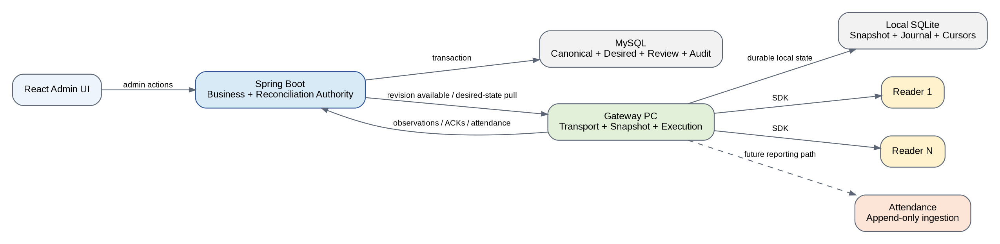
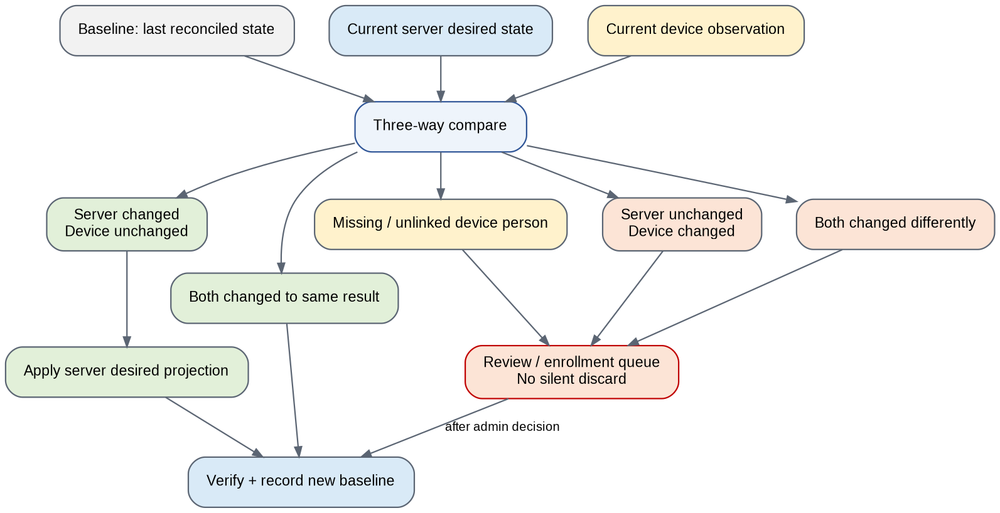

**GYM PLATFORM**

**Gym Device Sync & Reconciliation**

**Final architecture and implementation baseline**

| **Status**                   | PROPOSED — implementation baseline; hardware POC gates remain                                                 |
|------------------------------|---------------------------------------------------------------------------------------------------------------|
| **Owner**                    | Gym Platform Engineering                                                                                      |
| **Last updated**             | October 6, 2026                                                                                               |
| **Scope**                    | Member state, reader projections, offline edits, reconciliation, gateway reliability, and attendance boundary |
| **Topology**                 | One gateway per gym; N readers; single Spring Boot service + MySQL backend                                    |
| **Primary design principle** | One business reconciliation brain: the server. Gateway executes and transports; readers enforce locally.      |

This document is the implementation-facing outcome of reviewing the two supplied engineering approaches, the supplied gateway rulebook/plan, and the subsequent clarification of device and business behaviour. It intentionally separates business decisions from unverified hardware behaviour. Anything marked POC REQUIRED is not to be encoded as a hard invariant until tested on the target TrueWatch 3000 + Dahua SDK firmware.

<table>
<colgroup>
<col style="width: 100%" />
</colgroup>
<thead>
<tr class="header">
<th>
<strong>Executive decision</strong>

Do not implement the existing timestamp/master-device conflict model. Replace it with a server-authoritative desired-state architecture plus three-way reconciliation for device-originated changes. The gateway may perform mechanical local execution and provisional propagation, but it must not decide business ownership of conflicting member data.
</th>
</tr>
</thead>
<tbody>
</tbody>
</table>

# 1. Decision summary

The final system should behave like a declarative controller rather than a peer-to-peer merge engine: the backend owns canonical member and access state; each reader is a local projection; the gateway keeps those projections executable and recoverable; and device-side changes that cannot be safely attributed to the canonical state become explicit review items rather than being silently overwritten.

- **One identity:** Member identity is \`publicId\`. \`deviceUserId\` is scoped to a reader and is never used as a tenant-wide member key.

- **One business brain:** The server decides canonical member state and conflict outcomes. The gateway never decides “latest wins”, “device 1 wins”, or identity merges.

- **Declarative convergence:** Each reader has a server-defined desired projection and an applied revision. The system reconciles to that desired state rather than replaying an unbounded history of per-member commands.

- **Offline continuity:** Reader-side work continues without cloud connectivity. The gateway records observations locally and can propagate safe, mechanical changes over the gym LAN without treating them as final truth.

- **No silent loss:** Reader-side creations/edits/deletes that cannot be safely resolved automatically create pending enrollment/review items.

- **Attendance is separate:** Attendance is append-only device data and must not become part of the member-state reconciliation loop.

# 2. Hard decisions and invariants

These are the rules implementation should treat as architectural invariants. They supersede earlier rulebook statements where they conflict with the clarified device/API facts.

| **Invariant**       | **Rule**                                                                                                                                           | **Why**                                                                      |
|---------------------|----------------------------------------------------------------------------------------------------------------------------------------------------|------------------------------------------------------------------------------|
| Identity            | \`publicId\` is the member identity; \`(deviceId, deviceUserId)\` identifies a device-side user record.                                            | Prevents the current serial/device-ID collision problem.                     |
| Canonical truth     | Server owns canonical business state; readers hold projections.                                                                                    | Eliminates competing business brains.                                        |
| Reader edits        | Reader changes are observations/change requests, not automatic truth.                                                                              | The SDK exposes snapshots, not mutation history or reliable revisions.       |
| Conflict resolution | Use baseline + server desired + current device observation. Never use clock timestamps to pick a winner.                                           | No reliable user-level revision/change ID exists on the reader API.          |
| Full logical write  | Every user update writes the full logical user record; face is written through the verified face path as a separate operation.                     | The SDK may zero fields omitted from writes.                                 |
| Freeze vs removal   | Freeze/disable keeps the user record; removal deletes the device record. They are different operations.                                            | Matches device semantics and preserves server history.                       |
| Device deletion     | A device-side deletion never deletes the server member automatically.                                                                              | A device can erase a projection without proving business deletion.           |
| Final convergence   | When all required components are connected and review decisions are resolved, every reader must be semantically equal to the server desired state. | Provides the production invariant without requiring byte-for-byte SDK state. |
| No permanent master | There is no permanent master reader. Bootstrap is a reconciliation phase, not a peer hierarchy.                                                    | Avoids single-device authority and simplifies N-reader scaling.              |
| No blind replay     | On reconnect, observe reader state before applying potentially stale desired commands.                                                             | Prevents overwriting offline device changes before the server sees them.     |

# 3. What was wrong with the existing approaches

The supplied approaches contain useful implementation observations, but several design choices should be discarded rather than patched.

| **Existing approach**                       | **Assessment**                                                                                                         | **Final decision**                                                                         |
|---------------------------------------------|------------------------------------------------------------------------------------------------------------------------|--------------------------------------------------------------------------------------------|
| Master device + copy master roster          | Useful for a controlled migration, unsafe as a general source of truth.                                                | Replace with bootstrap reconciliation; no permanent master.                                |
| Latest timestamp wins                       | Cannot be trusted because device timestamps/revisions are not sufficient and gateway/server/device clocks can diverge. | Reject. Use three-way reconciliation.                                                      |
| Gateway fan-out + backend fan-out           | Duplicates writes and creates loop-prevention complexity.                                                              | Reject as the steady-state architecture. Server publishes desired state; gateway executes. |
| \`updatedByGateway\` boolean                | Solves one feedback-loop symptom but is not a versioning or consistency model.                                         | Do not use as the core sync primitive. Rework around revisions and observations.           |
| Device user ID == member serial             | Unsafe when different readers independently allocate IDs.                                                              | Reject. Keep device-local mapping.                                                         |
| Full roster every 15 seconds                | Expensive and unnecessary as the primary mechanism.                                                                    | Use alarms + targeted reads where possible + coalesced safety scans.                       |
| Durable store for every heartbeat           | Creates backlog and stale status replay.                                                                               | Do not persist high-frequency telemetry as replayable business events.                     |
| Replay outbound backlog before reading ACKs | Creates reconnect deadlock risk and repeats work.                                                                      | Read/receive concurrently; use bounded, idempotent queues.                                 |
| Reader deletion wins globally               | Can destroy a valid server member and other reader projection.                                                         | Treat as device drift/review; only server/admin decision changes canonical state.          |
| No-token gateway connection                 | Security critical.                                                                                                     | Release blocker: authenticated gateway connection only.                                    |

<table>
<colgroup>
<col style="width: 100%" />
</colgroup>
<thead>
<tr class="header">
<th>
<strong>Critical source inconsistency</strong>

The old rulebook asserts that alarm `0x3491` reliably identifies every user change and that `stuUpdateTime` is always zero. The clarified SDK facts do not support either statement: the relevant observed alarms are 0x3240/0x3216/0x3218/0x34C2 and their payloads vary; `stuUpdateTime` exists but its reliability is untested. The final architecture therefore treats alarms as scan triggers, not authoritative change records.
</th>
</tr>
</thead>
<tbody>
</tbody>
</table>

# 4. System boundary and responsibilities

The system is deliberately split into three responsibility domains. A component may execute work outside its primary domain, but it must not become the authority for another domain.

*Figure 1. Proposed production boundary*

| **Component**         | **Owns / decides**                                                                                                                                                 | **Must not decide**                                                           |
|-----------------------|--------------------------------------------------------------------------------------------------------------------------------------------------------------------|-------------------------------------------------------------------------------|
| Backend / Spring Boot | Canonical member state; memberships; accessAllowed; deviceRole; device mappings; desired per-reader projection; revision ordering; conflict/review outcome; audit. | Physical SDK behaviour; reader-local IDs; which clock is “newer”.             |
| Gateway               | Reader connections; snapshot collection; local journal; execution; retry; attendance buffering; reconnect; mechanically propagating safe local work.               | Business conflict winner; identity merge; canonical member creation approval. |
| Reader                | Local enforcement and local user/face storage; local admin operations; attendance log.                                                                             | Server identity; global member lifecycle.                                     |
| React UI              | Admin actions and review decisions; conflict comparison and explicit resolution.                                                                                   | Direct device-state authority outside server APIs.                            |

# 5. Canonical data model

The backend model should be extended around explicit projections and observations. The exact table names can differ, but the semantics should not.

| **Record**               | **Purpose**                                                              | **Key fields / notes**                                                                                                                                 |
|--------------------------|--------------------------------------------------------------------------|--------------------------------------------------------------------------------------------------------------------------------------------------------|
| Member                   | Canonical person/business identity.                                      | \`id\` internal DB PK; \`publicId\` immutable UUID; \`memberCode\`; profile; deviceRole USER/ADMIN; \`accessAllowed\`; archive status; face reference. |
| Membership / plan state  | Determines whether access is currently valid.                            | Start/end dates, payment/plan state. Effective door access requires allowed AND active membership.                                                     |
| Device                   | One physical reader.                                                     | Tenant, gateway, direction (IN/OUT for attendance), connection metadata.                                                                               |
| MemberDeviceMapping      | Only authoritative link from reader user to member.                      | Member publicId + device + deviceUserId + mapping status/history. One mapping per reader.                                                              |
| DesiredDeviceState       | What a reader should contain.                                            | Per-reader desired revision; deviceUserId; effective validity; frozen state; authority; face hash/reference; desired presence/absence.                 |
| DeviceObservedState      | Last known reader snapshot acknowledged by the server.                   | Normalized user fields + face hash; observedAt; source; snapshot hash.                                                                                 |
| SyncReviewItem           | Explicit unresolved device/user divergence.                              | Baseline, server state, per-device observations, evidence, suggested matches, resolution and actor.                                                    |
| PendingDeviceEnrollment  | A device-created/unlinked person not yet accepted as a canonical member. | Source device/user ID; snapshot; face reference; observedAt; review status.                                                                            |
| DeviceProjectionRevision | Monotonic desired-state sequence per reader.                             | Reader + revision; payload/version metadata; applied acknowledgement.                                                                                  |
| AttendanceEvent          | Append-only device punch.                                                | Reader + device recNo (candidate idempotency key); punch time; allowed/denied; method; raw error; resolved member when known.                          |

<table>
<colgroup>
<col style="width: 100%" />
</colgroup>
<thead>
<tr class="header">
<th>
<strong>Identity rule</strong>

Never perform `deviceUserId == memberCode`, `deviceUserId == serialNumber`, or “same integer across tenant” joins. All attendance and sync resolution must use `(deviceId, deviceUserId) -&gt; member` through `member_device_mapping`.
</th>
</tr>
</thead>
<tbody>
</tbody>
</table>

# 6. Access semantics

The backend should model access policy separately from device administrative authority. The device representation is a projection of that policy.

| **Business concept**  | **Canonical meaning**                                                              | **Reader projection**                                                               |
|-----------------------|------------------------------------------------------------------------------------|-------------------------------------------------------------------------------------|
| Member identity       | \`publicId\`                                                                       | Local \`szUserID\` chosen for that reader via mapping.                              |
| Device role           | USER or ADMIN                                                                      | SDK authority field. ADMIN permits device-management operations; USER does not.     |
| Access allowed        | Explicit admin allow/disallow flag.                                                | \`nUserStatus\`: 0 enabled, 1 frozen, subject to POC verification.                  |
| Membership validity   | Paid/current plan period.                                                          | Device valid-begin / valid-end fields.                                              |
| Effective door access | \`accessAllowed == true\` AND membership currently active AND member not archived. | Device must be provisioned so that its local enforcement reflects this combination. |
| Disable               | Keep member and device user; block access.                                         | Freeze same user; do not remove record.                                             |
| Remove from reader    | Projection no longer present on that reader.                                       | \`REMOVE_USER\` / equivalent. Does not delete canonical member.                     |

<table>
<colgroup>
<col style="width: 100%" />
</colgroup>
<thead>
<tr class="header">
<th>
<strong>POC gate — freeze semantics</strong>

The SDK labels `nUserStatus=1` as “freeze”, but the supplied material has not proven that it actually blocks the door on target firmware. Do not claim access-control correctness in production until this is tested. This is a release gate, not a minor documentation item.
</th>
</tr>
</thead>
<tbody>
</tbody>
</table>

# 7. Three-way reconciliation model

Because the reader exposes snapshots rather than durable mutation records, the server must compare three states: the last reconciled baseline, the current server desired state, and the current device observation.

*Figure 2. Three-way reconciliation decision*

| **Baseline (B)** | **Server desired (S)** | **Device observed (D)** | **Outcome**                                                                               |
|------------------|------------------------|-------------------------|-------------------------------------------------------------------------------------------|
| B = S            | B = D                  | No differences          | No-op; record healthy.                                                                    |
| B = S            | B != D                 | Device changed          | Create review/change request. Do not silently overwrite.                                  |
| B != S           | B = D                  | Server changed          | Apply server desired state to device; verify.                                             |
| B != S           | B != D                 | S = D                   | Both sides converged independently. Accept as converged; update baseline and audit.       |
| B != S           | B != D                 | S != D                  | True conflict. Create review item; do not choose a winner automatically.                  |
| No baseline      | Any                    | Unlinked/missing        | Treat as bootstrap/enrollment/drift. Require mapping/review; no automatic identity merge. |

The same logic is applied to complete records first. Field-level merge is deliberately deferred. The review UI should show the server snapshot, each reader snapshot, and the last reconciled baseline side-by-side so the admin can understand exactly what changed.

# 8. Device-created member workflow

Offline enrollment is supported without turning the gateway into a second business authority.

1\. **Reader enrolment:**A device admin creates the person. The reader returns an existing \`szUserID\`; the gateway preserves it for that reader.

2\. **Local snapshot:**Gateway reads the full current user record and face and stores a durable local observation/journal entry.

3\. **Optional local propagation:**If the backend is unavailable, gateway may mechanically provision the new provisional person to other readers so the gym can continue operating. This is a technical propagation decision, not acceptance of member identity.

4\. **ID collision on sibling:**If the same deviceUserId is already occupied on a target reader, allocate a different free device-local ID on that target and persist the mapping. Never overwrite the existing user.

5\. **Reconnect:**Gateway sends the enrollment observation to the backend.

6\. **Review:**Backend creates a pending enrollment. Admin can create a new member, link to an existing member, or reject/remove it. Candidate matches may be suggested using name/face/evidence, but never auto-merged.

7\. **Canonicalize:**Server allocates or confirms per-reader device IDs, generates the desired projection for every reader, and increments reader revisions.

8\. **Convergence:**Gateway applies and verifies the canonical projection across all readers.

# 9. Device edits, admin promotions, and conflicts

The gym owner may legitimately edit a user or promote a user to ADMIN directly on a reader. The server therefore cannot treat all reader-side changes as malicious or invalid; it must treat them as controlled, reviewable observations.

| **Scenario**                                         | **What system does**                                                                                                                | **What it must not do**                                                                   |
|------------------------------------------------------|-------------------------------------------------------------------------------------------------------------------------------------|-------------------------------------------------------------------------------------------|
| Name/validity/access edit on one reader              | Detect via snapshot diff, report to server, create review if it conflicts with canonical desired state.                             | Do not silently discard or choose by timestamp.                                           |
| ADMIN promotion on reader                            | Report observed authority change; place in review if baseline/server differ; admin can approve.                                     | Do not invent cryptographic proof of who made the change if the device cannot provide it. |
| Different edits on two readers while gateway offline | Do not fan-out one over the other if both diverged from the same baseline. Preserve both observations and create one conflict item. | Do not pick Device 1, Device 2, or latest clock as winner.                                |
| Same result independently on two readers             | Accept as converged after comparison; audit evidence.                                                                               | Do not require manual review for identical resulting state unless policy requires it.     |
| Reader-side deletion                                 | Record device deletion/drift; keep canonical member. Admin may restore or approve global deprovisioning.                            | Do not delete the backend member because a projection disappeared.                        |

# 10. Desired-state propagation and command execution

Per-member command queues should no longer be the primary consistency model. The server should expose a versioned desired projection that the gateway can pull in bounded chunks.

1\. **Canonical write:**A React/server change is committed to canonical member/membership state.

2\. **Projection transaction:**The same DB transaction computes the affected readers and creates/updates desired projection revisions.

3\. **Wake-up signal:**Gateway receives a lightweight “desired revision available” notification over authenticated WSS. The notification need not contain the full payload.

4\. **Bounded pull:**Gateway asks for desired changes after its saved applied revision, with a limit/page size.

5\. **Reader execution:**Gateway applies only actual differences. User updates are full logical-record writes; face is a separate operation.

6\. **Verification:**Gateway reads back enough state to verify the operation or receives an SDK-confirmed success according to the POC-tested semantics.

7\. **Ack:**Gateway records the highest fully applied reader revision. Server marks that reader caught up to that revision.

8\. **Supersession:**A newer desired revision makes older desired instructions stale. There is no need to replay every intermediate business edit to the reader.

<table>
<colgroup>
<col style="width: 100%" />
</colgroup>
<thead>
<tr class="header">
<th>
<strong>Reconnection order</strong>

On gateway reconnect: authenticate -&gt; re-establish reader health -&gt; collect current reader observations -&gt; send observations/cursors to server -&gt; pull current desired revisions -&gt; apply/verify -&gt; acknowledge. Never blindly replay stale desired commands before observing the reader.
</th>
</tr>
</thead>
<tbody>
</tbody>
</table>

# 11. Gateway local persistence and reliability

The gateway should move from multiple JSON-based stores to a small SQLite journal. The database is not a second business brain; it is durability for execution state and observations while the network is unavailable.

| **Local record**       | **Purpose**                                                                             | **Retention**                                       |
|------------------------|-----------------------------------------------------------------------------------------|-----------------------------------------------------|
| Reader snapshot        | Last normalized reader observation for diff detection and offline local reconciliation. | Current + recent history needed for audit; bounded. |
| Desired applied cursor | Highest verified server revision per reader.                                            | Until reader is rebuilt/migrated; compact.          |
| Outbound event journal | Attendance, enrollment, observation and audit events awaiting cloud delivery.           | Until ACKed, then bounded retention.                |
| Provisional enrollment | Offline device-created users awaiting server review.                                    | Until resolved; then bounded audit copy.            |
| Attendance cursor      | Last safely processed reader attendance position/window.                                | Until data is confirmed server-side, then bounded.  |
| Retry metadata         | Attempt count, next attempt, last error.                                                | Until terminal/success; compact.                    |

- **Do not persist heartbeats as replayable business events.** Keep current health state in memory and emit telemetry/status snapshots as telemetry.

- **Use one worker/connection owner per reader.** Avoid shared mutable dictionaries and overlapping roster reads/writes.

- **Coalesce scans.** Multiple alarms during a short window should produce one reader scan, not N full scans.

- **Bound all queues.** Old low-value telemetry should expire; business events such as enrollment and attendance should have explicit retention and alerting.

- **Retry independently.** A failed reader operation must not block other readers or backend delivery.

# 12. Reader scan strategy: production-safe, not continuous polling

The gateway should use a three-tier detection strategy. The exact intervals must be benchmarked rather than assumed.

| **Trigger**                            | **Action**                                                          | **Cost control**                                                                                              |
|----------------------------------------|---------------------------------------------------------------------|---------------------------------------------------------------------------------------------------------------|
| Alarm with a user ID (where supported) | Targeted read of that user and face if applicable.                  | No full roster scan.                                                                                          |
| Alarm without a user ID                | Coalesced full roster scan for that reader.                         | Debounce/serialize scans; never run two roster scans concurrently.                                            |
| Periodic safety reconciliation         | Full roster/digest scan at a low-frequency, staggered interval.     | Benchmark against 1k/5k/10k users and schedule off-peak; do not use 15-second polling as a default invariant. |
| Reconnect                              | Full current observation of the reader before desired-state replay. | One scan per reconnect event with backoff if reader is slow.                                                  |

The gateway should persist a normalized snapshot hash and per-user fingerprint. If a full scan is required, compare locally first and only send changed/unresolved items upstream. Face reads should be performed only when needed; a face hash can avoid repeated JPEG transfers when the device API allows it.

# 13. Initial bootstrap / first installation

The earlier “master device” model is not the right long-term architecture. First installation is instead a bootstrap reconciliation between server canonical state, existing device snapshots, and existing device mappings.

| **Bootstrap case**                                   | **Treatment**                                                                                                                |
|------------------------------------------------------|------------------------------------------------------------------------------------------------------------------------------|
| Readers empty; server has members                    | Server desired projection seeds all readers.                                                                                 |
| Reader + server member with existing mapping         | Compare current reader snapshot against server desired state; apply or review based on three-way/baseline availability.      |
| Reader has unlinked person                           | Create Pending Device Enrollment. Suggest identity matches, but do not auto-link.                                            |
| Two readers have same device ID but different people | Treat as separate device-local identities; create/retain per-reader mappings and surface the collision.                      |
| Two readers have same person but different IDs       | Evidence-based suggestion may link them; admin confirms. Preserve each local device ID until canonical projection is chosen. |
| Existing data quality is too ambiguous               | Do not overwrite. Quarantine to a bootstrap review queue and provide a migration report.                                     |

<table>
<colgroup>
<col style="width: 100%" />
</colgroup>
<thead>
<tr class="header">
<th>
<strong>Bootstrap warning</strong>

A pre-existing live installation with weak/incorrect mappings cannot be made safe by an “initial sync” algorithm alone. If identity mappings are missing, the system must expose the ambiguity instead of silently making identity guesses.
</th>
</tr>
</thead>
<tbody>
</tbody>
</table>

# 14. Attendance boundary

Attendance is intentionally isolated from member synchronization. The reader stores access-card records that can be queried by time window and include user ID, time, result, method, record number and denial code. The gateway buffers these records and the backend stores them append-only.

| **Rule**              | **Decision**                                                                                                                                             |
|-----------------------|----------------------------------------------------------------------------------------------------------------------------------------------------------|
| Reader direction      | Store IN/OUT direction per reader configuration.                                                                                                         |
| Idempotency key       | Candidate \`(deviceId, recNo)\`; validate persistence/uniqueness across reboot and retention on hardware.                                                |
| Query strategy        | Use bounded time windows; only use \`afterRecNo\` if target firmware POC proves it works.                                                                |
| Member resolution     | Resolve \`(deviceId, deviceUserId)\` through mapping. Keep raw device identity even when member mapping is unavailable.                                  |
| Missing IN/OUT        | Do not treat as sync errors. Reports can show incomplete sequences.                                                                                      |
| Performance isolation | Attendance ingestion must not hold up member reconciliation. If reporting threatens device-sync performance, keep reports as a lower-priority subsystem. |

# 15. Security requirements

- **Gateway authentication is mandatory.** A gym has one gateway. No connection without that gateway's credential. Never bind gateway identity from an unauthenticated message payload.

- **Gateway scope is tenant-bound.** A gateway may receive only its own tenant/gym projections.

- **All WSS/HTTPS traffic is authenticated and encrypted.** Cloudflare/nginx are transport infrastructure, not an authorization layer.

- **Face data is sensitive.** Store encrypted at rest, never write face bytes to logs, and restrict administrative access.

- **Device ADMIN is an explicit permission.** The server can accept reader-originated ADMIN changes through the review process, but the system must not claim to know which human pressed the device buttons unless the hardware provides auditable identity.

- **Replay protection.** Every inbound/outbound business message must be idempotent or revision-scoped.

- **Audit every resolution.** Record who approved a pending enrollment/conflict, source observations, selected state, and resulting projection revision.

# 16. Failure and recovery matrix

| **Failure**                    | **Expected system behaviour**                                                                                                           | **Data-loss stance**                                      |
|--------------------------------|-----------------------------------------------------------------------------------------------------------------------------------------|-----------------------------------------------------------|
| Internet down                  | Readers continue local operation; gateway persists observations and outbound events; server changes remain queued as desired revisions. | No silent loss; temporary divergence allowed.             |
| Gateway process restart        | Recover SQLite journal, reader cursors and applied revisions; reconnect; observe readers before applying desired state.                 | No replay-as-truth; idempotent recovery.                  |
| Reader offline                 | Other readers continue. Pending reader projection remains pending and retries on health recovery.                                       | No impact on other readers.                               |
| Backend restart                | Gateway retains local state/events and retries cloud delivery.                                                                          | No loss if local retention not exhausted.                 |
| Server command arrives twice   | Revision/idempotency makes the second application a no-op.                                                                              | No duplicate business effect.                             |
| Stale desired revision arrives | Gateway ignores stale revision and requests/uses newer state.                                                                           | No rollback to old member state.                          |
| Two readers diverge offline    | If both changed differently from the same baseline, preserve both and create conflict.                                                  | No silent overwrite.                                      |
| Reader user deleted            | Observation is recorded as device drift. Backend member remains.                                                                        | No automatic business deletion.                           |
| Reader factory reset           | Reader becomes empty/partial. Server desired projection rebuilds it from canonical state; face data comes from server.                  | Recovery possible because server stores face.             |
| Face write fails               | Do not claim projection fully applied. Retry and surface error.                                                                         | Member record may converge later; audit remains explicit. |

# 17. Operational observability

| **Signal**                    | **What to measure**                                        | **Suggested launch gate**                                  |
|-------------------------------|------------------------------------------------------------|------------------------------------------------------------|
| Projection lag                | Current desired revision - applied revision per reader.    | No continuously growing lag; alert on sustained lag.       |
| Oldest pending review         | Age of unresolved conflict/enrollment.                     | Business-defined SLA; visible in UI.                       |
| Reader reconciliation latency | Alarm/reconnect/safety scan to verified convergence.       | Establish baseline on target device and user counts.       |
| SDK latency                   | Read roster, read user, face read, write user, face write. | Capture p50/p95/p99; use to tune concurrency.              |
| Sync error rate               | Permanent vs transient SDK failures.                       | No silent retries; terminal errors visible.                |
| Gateway outbound queue depth  | Pending attendance/enrollment/observation events.          | Bounded; alert before retention exhaustion.                |
| Conflict rate                 | Device-originated changes requiring review.                | Track by gym/device and investigate abnormal spikes.       |
| Reader drift rate             | Unexpected device deletions/edits.                         | Should be explainable; alerts for repeated drift.          |
| Authentication failures       | Invalid gateway connection attempts.                       | Alert on spikes; must never fall back to anonymous access. |

The current system is also a single-VPS/single-Spring-instance deployment. Gateway buffering protects gym-local continuity, but backend availability remains a central operational dependency. Backups, restore testing, and eventual backend HA should be tracked separately from sync correctness.

# 18. Production POC / hardware verification gates

These items remain intentionally unverified. They are the only remaining hardware/SDK facts that should block specific implementation claims.

| **ID** | **POC question**                                                                                   | **Why it matters**                                                                          | **Status**       |
|--------|----------------------------------------------------------------------------------------------------|---------------------------------------------------------------------------------------------|------------------|
| P1     | Does \`nUserStatus=1\` actually prevent door access on target firmware?                            | Determines whether accessAllowed can be enforced via freeze.                                | UNKNOWN          |
| P2     | When device UI creates a user, how is \`szUserID\` chosen?                                         | Confirms provisional-ID handling and collision policy.                                      | UNKNOWN          |
| P3     | Does INSERT of an existing \`szUserID\` update all required fields without zeroing omitted values? | Validates full-record write semantics.                                                      | PARTIAL / verify |
| P4     | Does \`stuUpdateTime\` change predictably for every relevant mutation?                             | Determines whether it can be telemetry only; never use for conflict ordering unless proven. | UNKNOWN          |
| P5     | Does each relevant alarm fire reliably, and what is its payload on this firmware?                  | Determines targeted vs full-scan opportunities.                                             | UNKNOWN          |
| P6     | Does \`nRecNo\` remain monotonic/persistent across reboot, storage full, and time windows?         | Determines attendance cursor design.                                                        | UNKNOWN          |
| P7     | Can attendance be queried strictly after \`recNo\` or only by time window?                         | Determines backfill algorithm.                                                              | UNKNOWN          |
| P8     | What is reader attendance retention?                                                               | Defines maximum outage recovery guarantee.                                                  | UNKNOWN          |
| P9     | What happens when the same face is created under two device user IDs?                              | Needed for offline provisional propagation and migration.                                   | UNKNOWN          |
| P10    | What are safe roster sizes and concurrent SDK-operation limits?                                    | Determines scan cadence/concurrency.                                                        | UNKNOWN          |
| P11    | Exact validity boundary behavior and timezone handling on device.                                  | Prevents membership start/end-day bugs.                                                     | UNKNOWN          |
| P12    | Reader replacement/factory reset signals or reliable empty-state detection.                        | Improves automatic projection repair.                                                       | UNKNOWN          |

# 19. Implementation sequence

| **Milestone**                           | **Deliverable**                                                                             | **Exit criteria**                                                                          |
|-----------------------------------------|---------------------------------------------------------------------------------------------|--------------------------------------------------------------------------------------------|
| M0 — POC                                | Hardware verification harness covering P1-P12.                                              | Results recorded; launch-blocking unknowns closed.                                         |
| M1 — Canonical model                    | Member/device mapping, desired projection, observed snapshot, review queue, revision model. | DB invariants + service tests pass; no device IDs used as member identity.                 |
| M2 — Gateway persistence                | SQLite journal, per-reader worker, snapshots, cursors, bounded retry.                       | Gateway restart/network-outage tests preserve state and do not duplicate business effects. |
| M3 — Desired-state sync                 | Server projection API + gateway pull/apply/verify/ack.                                      | Server-only changes converge on N readers; stale revisions cannot roll back state.         |
| M4 — Offline reader changes             | Device observation ingestion, local mechanical propagation, pending enrollment/review.      | Offline create/edit/admin/delete scenarios converge without silent discard.                |
| M5 — Bootstrap migration                | Existing-gym mapping/review tooling; no master dependency.                                  | Ambiguous identities visible; known mappings converge automatically.                       |
| M6 — Attendance (optional but isolated) | Durable event buffer, cursor/backfill, unique event identity, reports.                      | POC proves retention/cursor semantics; attendance never blocks member sync.                |
| M7 — Cutover                            | Disable duplicate fan-out/timestamp merge path; retain rollback switch temporarily.         | Shadow parity demonstrated; no unresolved P0/P1 correctness defects.                       |

# 20. Test strategy

The acceptance suite should test state transitions rather than individual methods. Every scenario should assert canonical state, each reader projection, mapping, review/audit record, and queue/revision state.

| **Scenario**                                                    | **Expected result**                                                                                                                                |
|-----------------------------------------------------------------|----------------------------------------------------------------------------------------------------------------------------------------------------|
| Server creates member online                                    | Server canonical + all reader desired projections updated; gateway converges and verifies.                                                         |
| Server edits member while gateway offline                       | Desired revision persists; reconnect observes device first, then applies/reviews based on three-way state.                                         |
| Reader 1 creates member offline                                 | Gateway stores provisional enrollment; reader remains operational; on reconnect backend creates review item; final approval converges all readers. |
| Reader 1 edits; Reader 2 unchanged offline                      | Gateway may provisionally propagate the mechanical change; backend later records/accepts or resolves through review.                               |
| Reader 1 and Reader 2 both edit same member differently offline | No winner chosen automatically; both observations retained; one conflict review item.                                                              |
| Reader deletes user                                             | Backend member remains; review shows device missing; admin can restore or approve deprovisioning.                                                  |
| Server disables member                                          | Desired projection keeps user and freezes it; verify door-block POC before declaring access secure.                                                |
| Server removes from all readers                                 | Desired presence becomes false on every reader; canonical member remains archived/retained.                                                        |
| Device promotes user to ADMIN offline                           | Observation becomes review; admin can approve; server then projects ADMIN to all readers.                                                          |
| Gateway restarts with pending work                              | SQLite state resumes; no duplicate final side effects.                                                                                             |
| Reader goes offline                                             | Other readers continue; pending projection retries only for failed reader.                                                                         |
| Backend receives duplicate event                                | Idempotent handling; no duplicate member/enrollment/attendance effect.                                                                             |
| Stale server revision arrives after newer revision              | Ignored; newer revision remains desired.                                                                                                           |
| Reader has unexpected deviceUserId collision                    | No overwrite; create mapping conflict / alternate device-local ID.                                                                                 |
| Reader factory reset                                            | Server desired projection rebuilds users and faces without manual full re-enrollment.                                                              |

# 21. Review UI requirements

The review queue is not an exception-handling drawer hidden from the product. It is part of the architecture. Each item should answer: what did the server want, what did each reader have, what was last known, what does the system suggest, and what will happen after the admin chooses?

- **Side-by-side comparison:** Server + each device + baseline, including name, validity, accessAllowed/effective access, role, face thumbnail/hash, deviceUserId and presence.

- **Evidence:** Source device, observed time, last reconciled revision, mapping, alarm/scan trigger, and whether other readers agree.

- **Actions:** Accept server, accept device snapshot, link to existing member, create new member, restore to reader, remove from all readers, or reject provisional enrollment.

- **Suggested matches:** Show ranked candidates based on evidence (name, face, mapping, other fields). Never auto-merge identity.

- **Audit:** Record decision, actor, prior state, chosen state and resulting server/device revisions.

# 22. What should be deleted or retired from the current design

- **Permanent master-device behaviour.** Keep only a bootstrap/migration procedure where needed.

- **Timestamp-based conflict winner logic.** Remove from device sync business rules.

- **Device-ID-as-serial fallback.** Remove from all identity resolution paths.

- **Gateway direct business fan-out as a primary path.** Replace with local mechanical propagation only for offline continuity; server becomes canonical after reconnect.

- **\`updatedByGateway\` as correctness mechanism.** It may remain temporarily for migration compatibility, but it must not be the new consistency model.

- **15-second full-roster polling as a default.** Replace with event-triggered/coalesced/safety reconciliation.

- **Unbounded heartbeat durability.** Move health to telemetry/state, not replayable business outbox.

- **Anonymous gateway connection fallback.** Delete immediately; credential is mandatory.

# 23. Open items that are not architectural blockers

There are no remaining business decisions that prevent the architecture from being designed. The following are implementation choices or hardware-verification tasks that can be closed in the POC and then reflected as concrete parameters:

- Final periodic safety-scan interval after performance benchmarking.

- SQLite schema/file layout inside the gateway implementation.

- Exact desired-state API URL and payload names.

- Face blob encryption and retention details on gateway temporary storage.

- Attendance reporting UX and visit-pairing rules, if the feature is retained.

- Exact free-ID allocator strategy per reader after collision POC.

# 24. Final recommendation

<table>
<colgroup>
<col style="width: 100%" />
</colgroup>
<thead>
<tr class="header">
<th>
<strong>Recommendation</strong>

Implement the server-authoritative desired-state + three-way reconciliation architecture. Treat the gateway as a durable edge controller, not a policy engine. Treat the readers as local projections and enforcement points, not sources of member identity. Make every ambiguous offline reader change visible to an admin. Build convergence around revisions and observed state, not timestamps or replaying every historical command.
</th>
</tr>
</thead>
<tbody>
</tbody>
</table>

The key mental model is: “server desired state + reader observed state + last reconciled baseline = deterministic reconciliation.” Once that model exists, reconnects, restarts, reader replacement, offline enrollment, duplicate commands and device drift become variations of the same problem instead of separate special-case algorithms.

# Appendix A. Source material reviewed

| **Source**                                           | **Role in analysis**                                                                                                                  |
|------------------------------------------------------|---------------------------------------------------------------------------------------------------------------------------------------|
| Kunal / GATEWAY_REQUIREMENTS_AND_TESTS.md            | Detailed current requirements, test cases, reconnect behaviour and device assumptions.                                                |
| Kunal / RULEBOOK.md                                  | Existing hard rules and invariants; several were intentionally rejected after clarification.                                          |
| Kunal / PLAN.md                                      | Existing implementation proposal; used to identify changes to keep vs retire.                                                         |
| Architecture review / gateway-architecture-review.md | Critical/high findings from comparison against established device-cloud reconciliation patterns.                                      |
| Target architecture / gateway-target-architecture.md | Initial desired-state, attendance and review-queue proposal; used as an input, not adopted wholesale.                                 |
| Follow-up architecture clarifications in this review | Authoritative clarification of identity, device IDs, SDK operations, offline business rules, permissions, face storage, and topology. |

# Appendix B. Glossary

| **Term**           | **Definition**                                                                                                          |
|--------------------|-------------------------------------------------------------------------------------------------------------------------|
| Canonical member   | Server-side business identity represented by immutable \`publicId\`.                                                    |
| Device user        | A user record stored on a specific reader and addressed by that reader’s \`deviceUserId\`.                              |
| Projection         | The device-specific representation the server wants a reader to contain.                                                |
| Observed state     | What the gateway most recently read from a reader.                                                                      |
| Baseline           | The last reader state known to have been reconciled/accepted by the server.                                             |
| Pending enrollment | An unlinked person created/observed on a reader that has not yet become a canonical member.                             |
| Review item        | A durable human-decision record for an ambiguous enrollment, conflict or device drift.                                  |
| Revision           | Monotonic server sequence used to order desired reader projections.                                                     |
| Drift              | Difference between desired server projection and actual reader observation that is not an intentional pending decision. |

# Appendix C. Technology choices that still hold

These choices come from the Phase 0 stack note (2026-09-10). Rules in that note that contradict this document are not carried forward: a per-member command outbox is not the consistency model, the server does store one face JPEG, and remote face write is not blocked by default.

| **Choice** | **Rule** |
|------------|----------|
| Backend | Java 21 and Spring Boot 4.1, one modular service. MySQL 8.4 with Flyway. No Hibernate auto-DDL in production. Numeric primary keys stay internal. `publicId` is the external UUID. Tenant scope, foreign keys, optimistic locking, and indexes follow real queries. |
| Gateway runtime | The gateway is the only process that calls the native SDK, so Spring Boot stays free of native libraries. It is C# on .NET 10, using the existing NetSDK binding. Do not rebind that surface in Java/JNA. Windows DLLs are already in the repo. `libdhnetsdk.so` loads in `TrueFaceLinuxPOC`; a physical Linux login has not been run. |
| Cloud link | The gateway opens an authenticated outbound WebSocket. The gym network does not accept inbound connections to readers. A cloud service cannot open TCP/37777 to a reader. The socket carries the desired-revision wake-up (section 10) and events. REST remains a fallback for ingest. Delivery is idempotent or revision-scoped, with durable retry and backoff. Not an in-memory queue and not a sleep loop. |
| Attendance vs access | Attendance stays append-only and outside member reconciliation (section 14). A business change and the desired projection it produces are written in the same database transaction. |
| Adapter boundary | Reader access goes through one adapter interface, with mock, simulator, and TrueFace implementations. The mock and simulator cover online and offline, events, denied access, delayed or failed acknowledgements, duplicates, and gap recovery, so development does not require hardware. |
| Biometrics | Recognition templates stay on the reader. The server stores one resized JPEG per member so a replaced or reset reader can be rebuilt (section 16). Face bytes are encrypted at rest and are never written to logs (section 15). |
| Face-write evidence | On 2026-09-13, unit `TW30000005250265` accepted a remote JPEG insert and operators saw the door open. That is one unit, not a proof for every firmware. |
| Gateway credential | A gateway enrolls once with a token, then uses a rotating operational credential. mTLS is unused. A connection with no credential is refused (section 15). |
| Frontend | React 19.3, TypeScript, Vite 8, React Router 7, and TanStack Query for server state. Tailwind v4 with shadcn/Radix, Recharts, Lucide, date-fns, and Motion with reduced motion. Do not store JWTs in `localStorage`. Use an httpOnly cookie, or an in-memory token with rotation. |
| Rejected | A Java/JNA gateway. iAS as a runtime dependency or a second source of truth. Continuous polling as the way changes are detected (section 12). |
